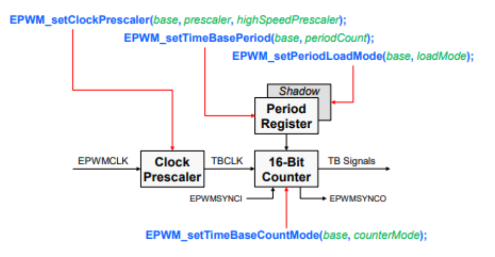
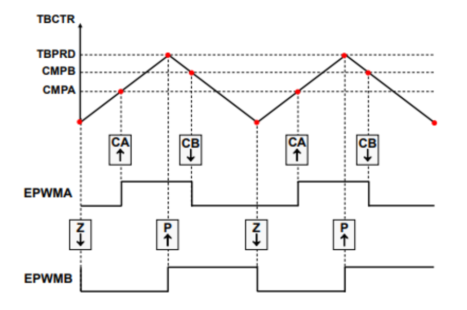
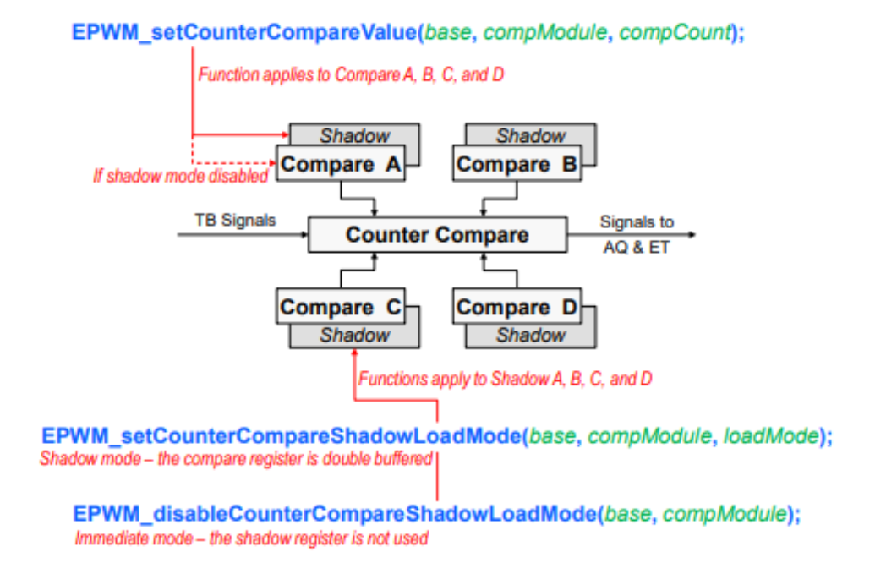
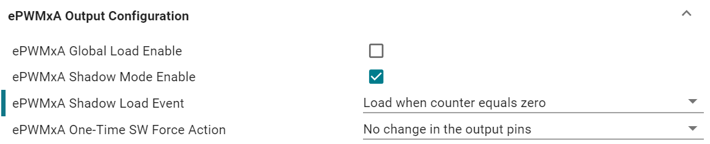
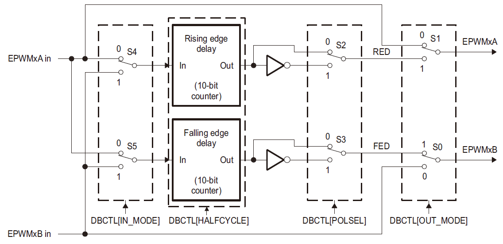
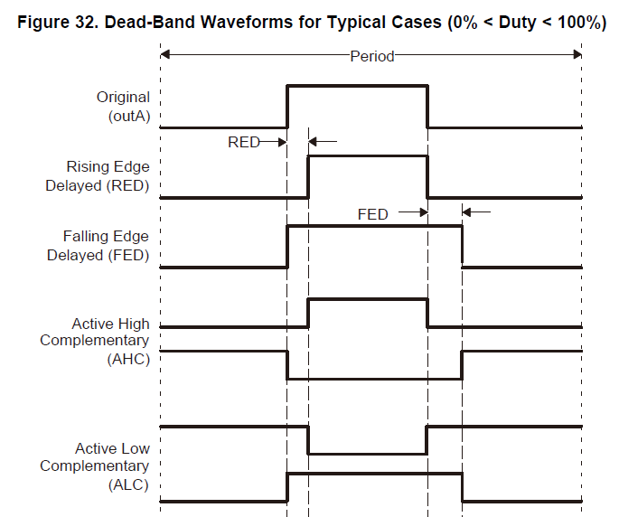
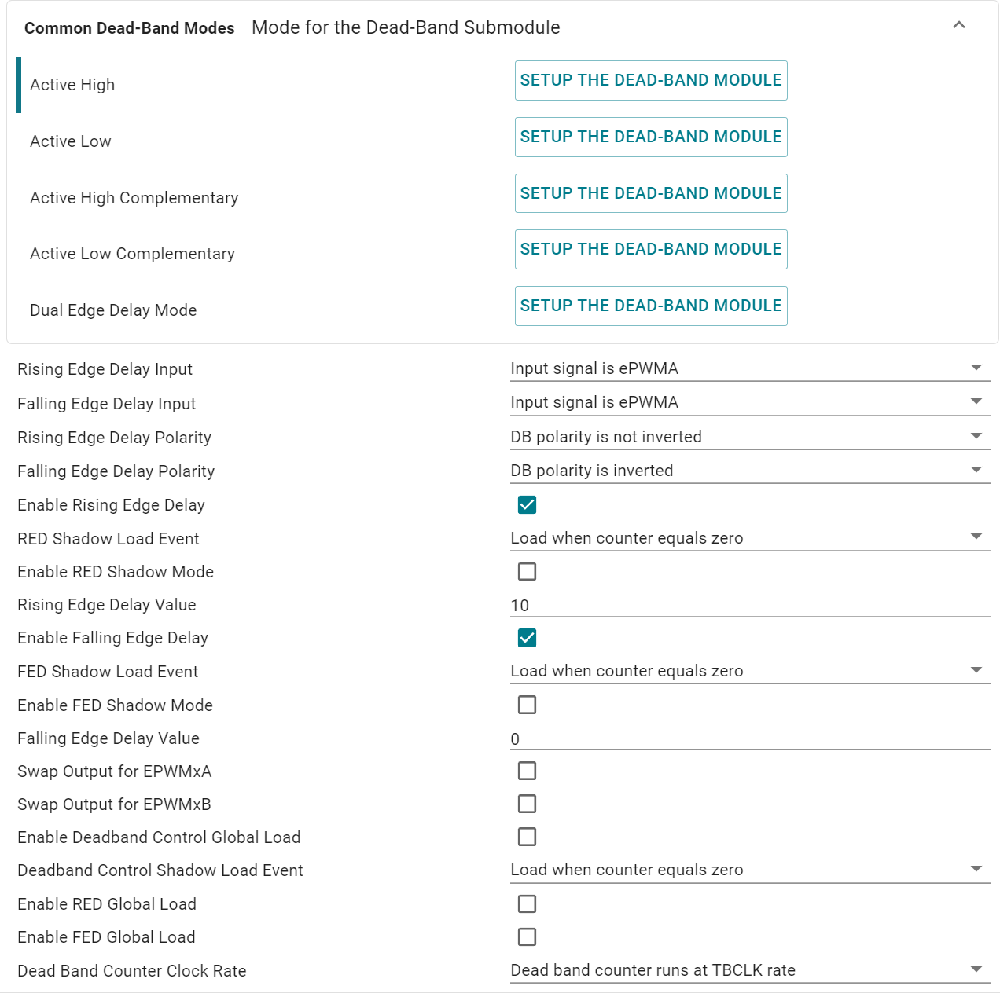

# EPWM of C2000

Reference given by TI's C28x Academy: [Enhanced Pulse Width Modulation (EPWM)](https://dev.ti.com/tirex/explore/node?node=A__AaKBh5Iw4k3VWS3akgXWzA__C28X-ACADEMY__1sbHxUB__LATEST)

Local examples at `[CCS]\C2000Ware[version]\driverlib\[device]\examples\epwm`

Local library at `[CCS]\C2000Ware[version]\driverlib\[device]\driverlib\epwm.h`

*LET SYSCFG DO EVERY FRICKING PART!*

## Access

C2000ware uses a uint32 as entrance of each EPWM module, it is often referred as `base` in most EPWM functions. `device.h` pre-defines them as marcos `EPWMx_BASE`. When configured with the syscfg tool in CCS, `board.h` will re-define them as marcos with user-determined names.


## Timebase

The timer of each EPWM module is referred as a TimeBase (TB), with clock signal `TBCLK` pre-scaled from `EPWMCLK`.

`EPWMCLK` is the same as `SYSCLK` on devices without `EPWMCLKDIV` and can be accessed by `DEVICE_SYSCLK_FREQ` in `device.h`. (It is commented in the library that `EPWMCLK` is half `SYSCLK` at reset, no idea what that means.)

`TBCLK` is calculated by:

$$TBCLK=\frac{EPWMCLK}{HSPCLKDIV \times CLKDIV}$$

Where `HSPCLKDIV` and `CLKDIV` is generally equivalent.



`periodCount` is referred as `TBPRD` in below. It can be shadowed to control the time of update. 

```c++
// To determine where to load TBPRD from
EPWM_setPeriodLoadMode(uint32_t base, EPWM_PeriodLoadMode loadMode)
typedef enum
{
    //! PWM Period register access is through shadow register
    EPWM_PERIOD_SHADOW_LOAD = 0,
    //! PWM Period register access is directly
    EPWM_PERIOD_DIRECT_LOAD = 1
} EPWM_PeriodLoadMode;

// To determine when to load TBPRD from the shadowed register (if used)
PWM_selectPeriodLoadEvent(uint32_t base,
                           EPWM_PeriodShadowLoadMode shadowLoadMode)
typedef enum
{
    //! Shadow to active load occurs when time base counter reaches 0
    EPWM_SHADOW_LOAD_MODE_COUNTER_ZERO = 0,
    //! Shadow to active load occurs when time base counter reaches 0 and a
    //! SYNC occurs
    EPWM_SHADOW_LOAD_MODE_COUNTER_SYNC = 1,
    //! Shadow to active load occurs only when a SYNC occurs
    EPWM_SHADOW_LOAD_MODE_SYNC         = 2
} EPWM_PeriodShadowLoadMode;
```

## Output from Internal Counters

CMPA/CMPB > Action-Qualifier Submodule -> Output



`CMPx` is a digital threshold. There are 4 of them in each EPWM module. CMPA/CMPB can be used to generate output in Action-Qualifier, while CMPC/CMPD can only used for Event-Trigger.

```c++
EPWM_setCounterCompareValue(uint32_t base, EPWM_CounterCompareModule compModule,
                            uint16_t compCount)
typedef enum
{
    EPWM_COUNTER_COMPARE_A = 0, //!< Counter compare A
    EPWM_COUNTER_COMPARE_B = 2, //!< Counter compare B
    EPWM_COUNTER_COMPARE_C = 5, //!< Counter compare C
    EPWM_COUNTER_COMPARE_D = 7  //!< Counter compare D
} EPWM_CounterCompareModule;

```

To determine how should output change according to `TB` and `CMPx`:
```c++
EPWM_setActionQualifierAction(uint32_t base,
                              EPWM_ActionQualifierOutputModule epwmOutput,
                              EPWM_ActionQualifierOutput output,
                              EPWM_ActionQualifierOutputEvent event)

typedef enum // output channel(pin) enumeration
{
    EPWM_AQ_OUTPUT_A = 0, //!< ePWMxA output
    EPWM_AQ_OUTPUT_B = 2  //!< ePWMxB output
} EPWM_ActionQualifierOutputModule;

typedef enum // action-qualifier event source enumeration
{
    EPWM_AQ_OUTPUT_ON_TIMEBASE_ZERO       = 0,      //Z
    EPWM_AQ_OUTPUT_ON_TIMEBASE_PERIOD     = 2,      //P
    EPWM_AQ_OUTPUT_ON_TIMEBASE_UP_CMPA    = 4,      //CA↑
    EPWM_AQ_OUTPUT_ON_TIMEBASE_DOWN_CMPA  = 6,      //CA↓
    EPWM_AQ_OUTPUT_ON_TIMEBASE_UP_CMPB    = 8,      //CB↑
    EPWM_AQ_OUTPUT_ON_TIMEBASE_DOWN_CMPB  = 10,     //CB↓
    EPWM_AQ_OUTPUT_ON_T1_COUNT_UP         = 1,      //T1↑
    EPWM_AQ_OUTPUT_ON_T1_COUNT_DOWN       = 3,      //T1↓
    EPWM_AQ_OUTPUT_ON_T2_COUNT_UP         = 5,      //T2↑
    EPWM_AQ_OUTPUT_ON_T2_COUNT_DOWN       = 7       //T2↓
} EPWM_ActionQualifierOutputEvent;
```



Like `TBRPD`, `CMPx`s are also shadowed. I think I will never re-configure those shadow-settings during operation, so just let syscfg handle the initiation.



Some example projects left the Shadow Mode disabled, but I think it is rather important to prevent sudden change of duty cycle & other stuff, given that the controller function may not be synchronous with EPWM modules.

## Interrupt from Event-Trigger

Like all other interrupts, this function is used:
```c++
static inline void Interrupt_register(uint32_t interruptNumber, void (*handler)(void))
```

In `EPWMx` modules the `interruptNumber` is referred as `INT_EPWMx`, all of which are in `INTERRUPT_ACK_GROUP3`. When use syscfg to configure EPWM, the `interruptNumber` will be defined as `INT_[name]`, and the corresponding ISR as `INT_[name]_ISR`.

To enable the interrupt of `EPWMx`:
```c++
EPWM_enableInterrupt(uint32_t base)     // use BASE, not INT
```

To set the source of interrupt (Why aren't those properly enumerated??):
```c++
EPWM_setInterruptSource(uint32_t base, uint16_t interruptSource)
//! Valid values for interruptSource are:
//!   - EPWM_INT_TBCTR_DISABLED       - Time-base counter is disabled
//!   - EPWM_INT_TBCTR_ZERO           - Time-base counter equal to zero
//!   - EPWM_INT_TBCTR_PERIOD         - Time-base counter equal to period
//!   - EPWM_INT_TBCTR_ZERO_OR_PERIOD - Time-base counter equal to zero or
//!                                     period
//!   - EPWM_INT_TBCTR_ZERO_OR_PERIOD - Time-base counter equal to zero or
//!                                     period
//!   - EPWM_INT_TBCTR_U_CMPx         - Where x is A,B,C or D
//!                                     Time-base counter equal to CMPA, CMPB,
//!                                     CMPC or CMPD (depending the value of x)
//!                                     when the timer is incrementing
//!   - EPWM_INT_TBCTR_D_CMPx         - Where x is A,B,C or D
//!                                     Time-base counter equal to CMPA, CMPB,
//!                                     CMPC or CMPD (depending the value of x)
//!                                     when the timer is decrementing
```

You can set how many times an event needs to occur before triggering the interrupt, clap for this one.
```c++
EPWM_setInterruptEventCount(uint32_t base, uint16_t eventCount)
```

## Dead-Band



When the Dead-Band submodule is enabled, the output is generated with reference to either `EPWMxA` or `EPWMxB`, normally `EPWMxA`

With all those switches controlled by bits `Sx`, there are some modes in dead-band generation. `Active-High Contemporary` means we want a both-low dead-band, and that the output waveform of both channel can be mid-aligned. `Active-Low Contemporary` then leads to a both-high dead-band.

For example, in `AHC` mode, *S3 = 1, S2 = 0, S1 = S0 = 1*. When a rising-edge comes from $A$, it is delayed for some time and then reaches the output A. While the falling-edge delay counter does not function and $\overline {A}$ is fed to output B. Vice versa when a falling-edge comes from $A$.




I think I would seldom edit dead-band during normal operation, so syscfg is good enough.



- `Input` field controls `S4/S5`, keep the default.
- `Polarity` field controls `S2/S3`

