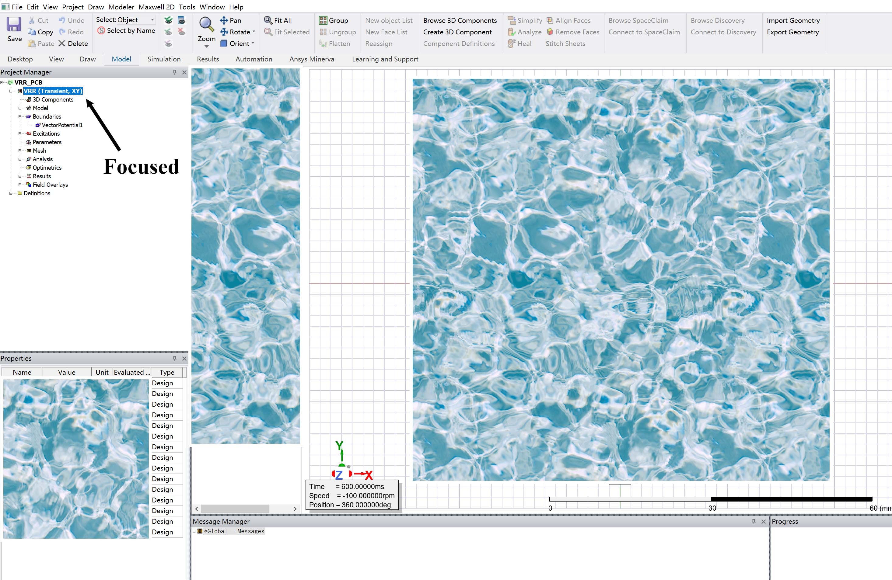
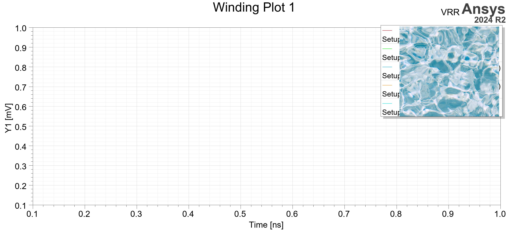

The electromagnetical simulation toolset of Ansys provides a handy interface for parametric modeling. Of cause such feature is guaranteed in most modern softwares, but trust me Ansys has done a fairly good job as compared to what Dassault has done in their Solidworks, or Altium in AD. Even better, Ansys is now building an API on Python (which is undoubtedly a wise choice, especially when [someone](/resrvplot/posts/pcb/delphiscript-for-altium-designer/) is still stuck with the stupid Delphi), enabling automatic batch-simulations.

The idea is simple: build a parametric model, let a python script manage the parameter set according to given simulation plan, leave the whole system run automatically, and get your data afterward. You may have your CPU run at 99% overnight and go back to sleep.

# Parametric Modeling

## Managing Variables

To manage design-level variables, right-click the design entity in the `Project Manager` window, then select `Designer Properties...`. 


Once a variable is created in the manager, it is editable in the `Properties` window in the bottom-left corner of the workspace, whenever the designer entity is focused.



:::important
Make sure the variables are on design-level, instead of project-level. The latter is managed via `Project` -> `Project Variables...`. It is theoretically possible that project-level variables can also be accessed by Python scripts, but it seems to be quite complex.
:::

## Applying Variables to Design

To refer to a design variable, use its name directly. Notice if you (insist to) use project-level variables, then they should be referred with their names and a '$' in front. E.g., this screenshot shows how to create a equation-driven curve with design variables A and B 👇


## Configuring Setup and Plot

I guess you can configure the analysis setup and result plot in PyAEDT, but it is just unnecessary when you can do that with GUI.

1. Configure a setup like you normally do. Notice the time step and stop time can be controlled by design variables as well. Remember the name of setup (by default it should be "Setup1").
2. Put the simulation data you want to export into a rectangular plot, remember the name of the plot.

If you just began with an empty design, then the plot would be empty like this, it's fine:



:::note
Yes it's possible to export data to multiple plots, and I *think* it is possible to export field report or others. But currently I have only validated PyAEDT with a single transient rectangular plot as the output.
:::

The parametric model is ready now. We can move on the the Python API system and figure out how to use Python script to overtake those variables and do the simulation.

# PyAEDT Library

To install PyAEDT (perhaps a conda env should be recommended):
```sh
conda install pyaedt
```

Refer to the [official online documents](https://aedt.docs.pyansys.com/) or visit the github repository for more info.

::github{repo="ansys/pyaedt"}

## AutoSim

It is explained below how to manipulate the parametric model with PyAEDT. First, launch Ansys Electronics Desktop in non-graphical mode, open the Ansys project file (`*.aedt`) and assign the design to simulate.

```python
from pyaedt import Maxwell2d
from pyaedt import Desktop

Desktop(specified_version="2024.2", non_graphical=True, new_desktop_session=False)
maxwell = Maxwell2d(projectname=projectPath, designname=designName)
```

:::important
Here the `projectname` of `Maxwell2d()` should be the absolute path of the .aedt file, while `designname` is just a string of name of the design.
:::

Then read the simulation plan and store each set of parameters in a dictionary.

```python
with open(planPath, mode='r', newline='', encoding='utf-8-sig') as file:
    reader = csv.DictReader(file)
    simPlan = [dict(row) for row in reader]

# An example of simulation plan (*.csv):
# K,wr,Rin,lmin,Next,Nind,SE,phis,DE,phid2,phid1,rpm,Tstep,Tsim
# 1.5,2,20mm,1mm,20,20,0.02mm,0deg,0.02mm,0deg,0deg,100rpm,50us,0.6s
# 1.5,2,20mm,1mm,20,20,0.02mm,0deg,0.02mm,0deg,0deg,-100rpm,50us,0.6s
```

Then let the simulations begin. For each round of simulation: 
1. Set the design variables according to the plan, the variables can be accessed by using `maxwell` object like a dictionary, with the variable names as keys. 
2. Call `analyze_setup()` to initiate certain analyze setup. If there is an HPC license, the simulation can be set to ran in parallel mode.
3. Call `post.export_report_to_csv()` to export the data of certain plot. The csv file is named as the plot by default, it should then be renamed immediately to avoid overwrite.
4. Save the project by `save_project()`.

```python
simIndex = 0
for simSet in simPlan:
    simIndex = simIndex + 1
    for variableName in simSet:
        maxwell[variableName] = simSet[variableName]
    
    maxwell.analyze_setup(name=setupName, cores=12, tasks=12)

    fileName = str(simIndex) + '.csv'
    maxwell.post.export_report_to_csv(project_dir=outputDir, plot_name=plotName)
    os.rename(f'{outputDir}\{plotName}.csv', f'{outputDir}\{fileName}')
    
    maxwell.save_project()

    time.sleep(sleepSlot)
```

The release version of the script can be found at:

::github{repo="tsaoo/EETools"}
