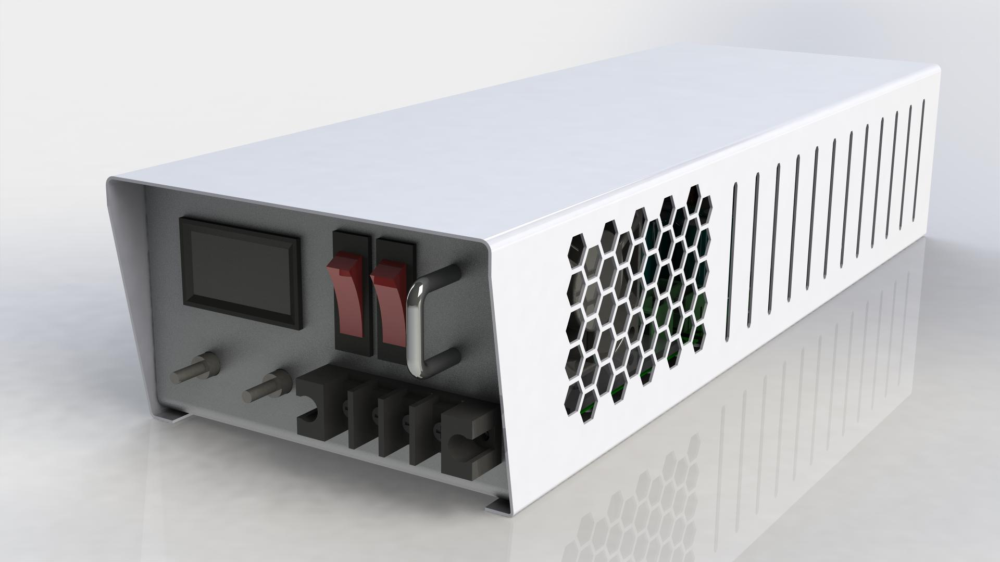
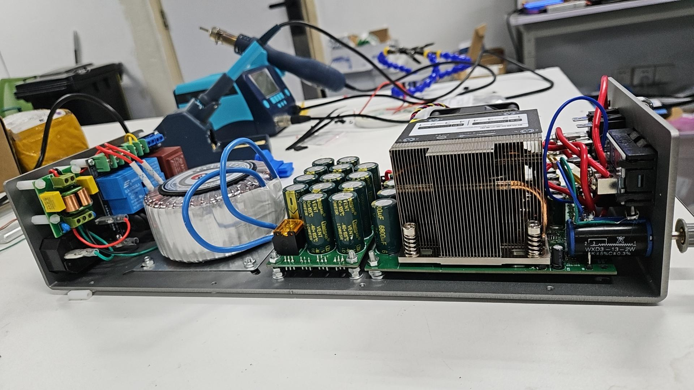
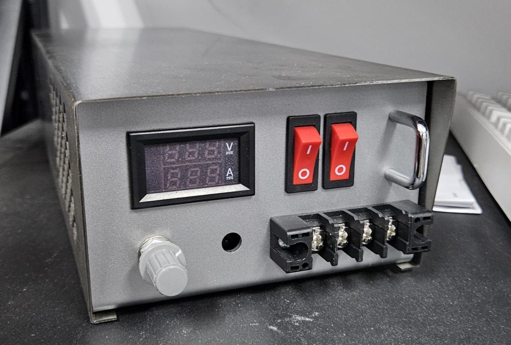

# Introduction

This is a linear power supply unit that takes 220V 50/60Hz AC power and outputs 12V DC voltage. It is designed for 150W but god knows how much exactly it can do, perhaps 200W, but it burns. In simulation the voltage fluctuation is less than 1mVpp at 150W, but in reality there is fucking ~100mVpp even with light load.

So this is not a PSU, this is utter shit. I know what's wrong with it, though. The problem is that the voltage reference is also driven by the stepped-down and rectified AC voltage, and there isn't enough filtering for the reference. It must be the point because the whole system is way too simple for any other thing to go wrong. However there's no chance for me to fix that since I finished it right before graduation. I guess I will write some details when and if I were happy to.