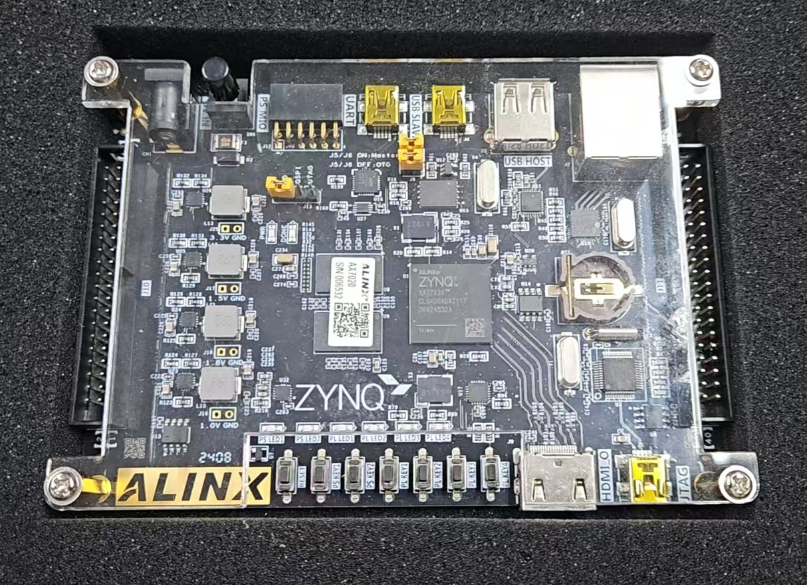
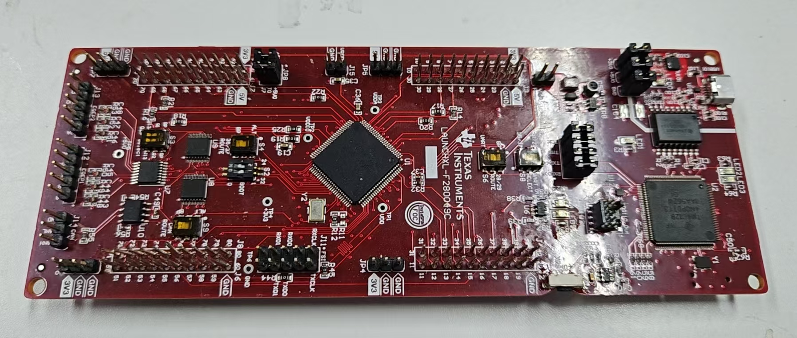
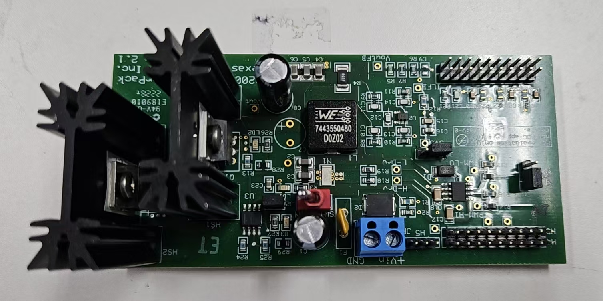
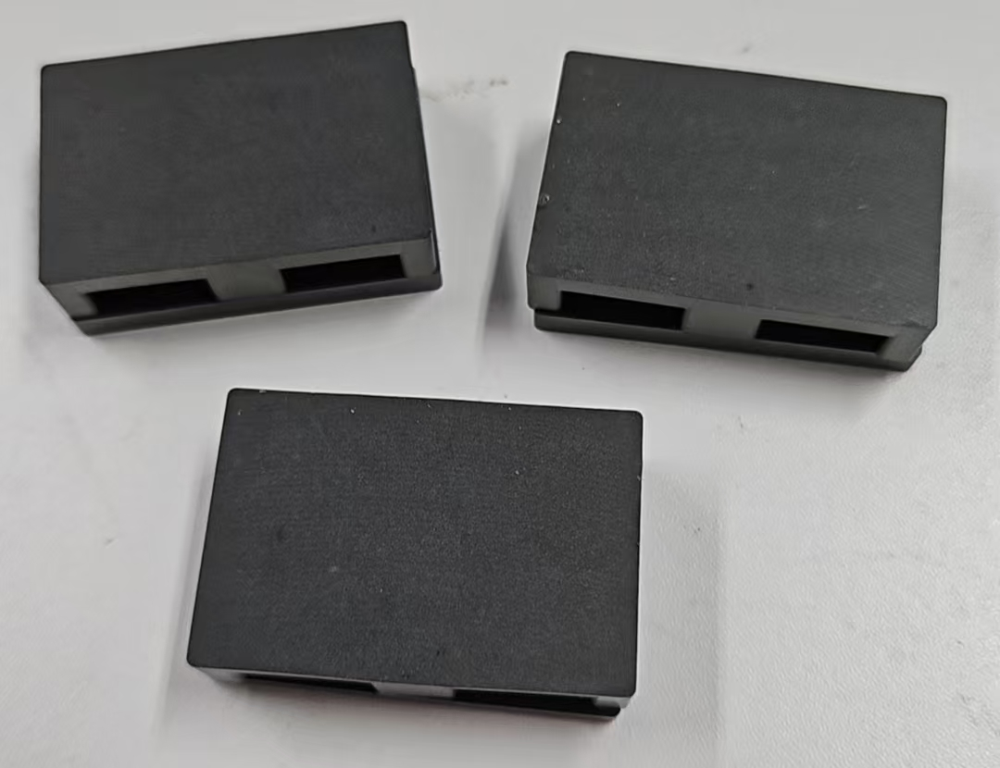
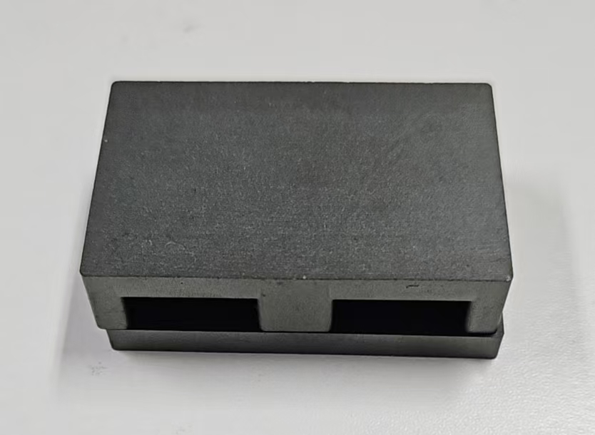
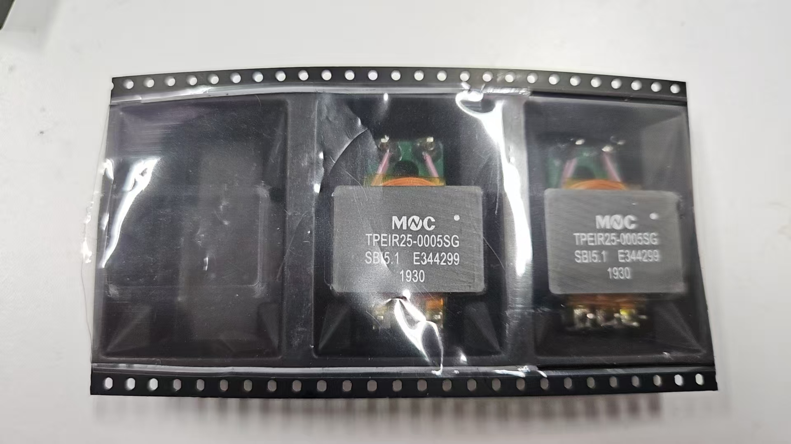
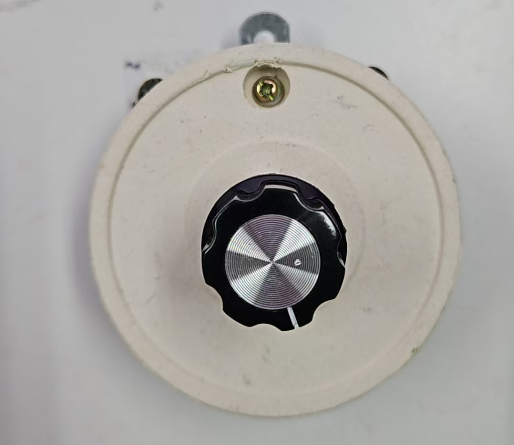
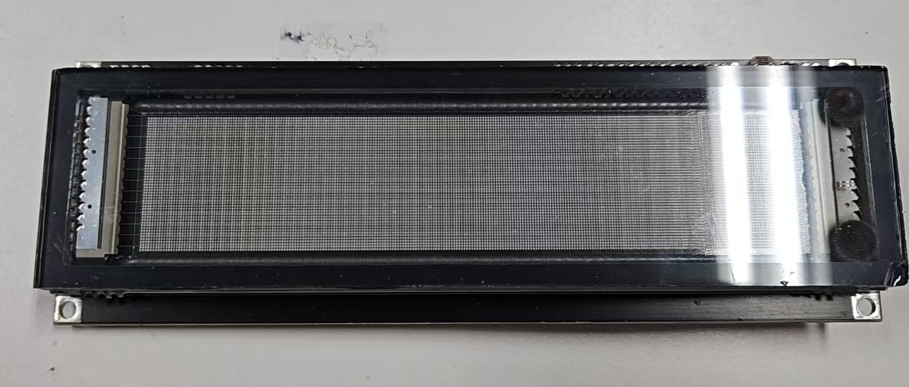

# 遗 物 甩 卖

*最后更新：6月7日 16:00*

你好。我马上要毕业了，在此甩卖遗物。老子讲过：“少则得，多则惑[1]”，如果你准备买我的东西，想必是要惑了。所以我尽量卖得便宜一些，好让你吃的亏少一点。

我懒得给每个东西拍照，而且越来越受不了Astro框架了。如果对下表中的任何条目感兴趣，请你微信联系我，或者发到[这个邮箱](mailto:zytsao@outlook.com)。

金币叮当作响，灵魂升入天堂！

[1] 老子, 《道德经》, 王弼注. 北京: 中华书局, 2007.

---

# 遗 物 表

## 书

| 东西 | 描述 | 建议开价 | 状态 |
|------|------|-----------|------|
| 古文观止（两卷），上海古籍出版社 | 好 | ¥20.00 | 没人要 |
| 穆斯林的葬礼，霍达 | 没读 | ¥10.00 | sold |
| 地下室手记，陀思妥耶夫斯基 | 读了一半，好 | ¥10.00 | 没人要 |
| 南十字星共和国——俄国象征派小说选 | 读了3/4，好 | ¥10.00 | sold |
| 摇摇晃晃的人间，余秀华 | 想不起来为什么在我这 | ¥10.00 | 没人要 |
| The Years, Virginia Woolf | 没读 | ¥10.00 | 没人要 |
| A Room of One's Own, VW | 没读 | ¥10.00 | 没人要 |
| To the Lighthouse, VW | 好 | ¥10.00 | 没人要 |
| Orlando, VW | 差 | ¥5.00 | 没人要 |
| Mrs Dalloway, VW | 读不下去 | ¥5.00 | 没人要 |
| 西方哲学史（两卷），商务印书馆 | 前10页没读懂 | ¥20.00 | 没人要 |
| 美学第一卷，黑格尔，商务印书馆 | 为什么在我这 | ¥15.00 | sold |
| 利维坦，霍布斯，商务印书馆 | 读了一半 | ¥15.00 | sold |
| 释梦，弗洛伊德，商务印书馆 | 没读 | ¥15.00 | sold |
| 雨中鹰及其他，特德休斯诗选 | 差中差，但毕竟很厚 | ¥15.00 | 没人要 |
| 微暗的火，纳博科夫 | 读了3/4，欣赏不来 | ¥10.00 | sold |
| 疯癫与文明，福柯 | 读了一半，忘了 | ¥10.00 | 没人要 |
| 魔山（两卷），上译 | 没读 | ¥20.00 | 没人要 |
| 广州话正音字典 | 没学会 | ¥15.00 | 没人要 |
| 人工智能——一种现代的方法（第三版），清华 | 课本，没用过 | ¥15.00 | 没人要 |
| 控制理论CAI教程，浙大林峰 | 课本，一看就是盗版 | ¥5.00 | 没人要 |
| 经济法理论与实务（第二版），浙大周黎明 | 课本 | ¥10.00 | 没人要 |
| 无线通信原理实验教程，邓焰陈宏 | 课本 | ¥5.00 | 没人要 |
| 通信原理（第七版）+习题，清华 | 课本 | ¥15.00 | 没人要 |
| 飞机邮票一本 | 他妈的为什么我还有这个 | ¥20.00 | sold |

## 开发板

|东西|描述|建议开价|状态|
|--|--|--|--|
AX7A035B 开发板一套|ALINX做的，Xilinx XC7A35T的板子，见[tb](https://detail.tmall.com/item.htm?abbucket=14&detail_redpacket_pop=true&id=596131978635)。原盒，保修卡还在，不带下载器|￥800.00|没人要
AX7020 开发板 |也是ALINX做的，Xilinx XC7Z020的板子，Zynq SoC，见[tb](https://detail.tmall.com/item.htm?id=595881671423)，原盒保修卡|￥1000.00|没人要
TI LAUNCHXL-F280049C 开发板 |TI原装，见[官网](https://www.ti.com/tool/LAUNCHXL-F280049C)。两个月前上电时序控制器的参考电压不准，导致reset不了，我换了PMIC的采样电阻，现在好了。我认为不是使用导致的问题（好久不用了），应该就是TI设计的电阻误差裕量没给够。|￥200.00|没人要|
BOOSTXL-BUCKCONV实验板 |TI原装，[官网](https://www.ti.com/tool/BOOSTXL-BUCKCONV)，配合LAUNCHXL的一个Buck变换器+电子负载，原盒|￥200.00|没人要|

## 杂项
|东西|描述|建议开价|状态|
|--|--|--|--|
平面变压器磁芯 N87(ELP+I) 3套 | TDK, 见[datasheet](https://www.tdk-electronics.tdk.com/inf/80/db/fer/elp_38_8_25.pdf) | 共￥100.00 | 没人要
平面变压器磁芯 EE32(E+I) PC95 一套 | 不知道谁产的，见[tb](https://item.taobao.com/item.htm?id=631209956995) | ￥15.00 | 没人要
平面变压器+PCBA 25:3:3 350W 2套  | [tb](https://item.taobao.com/item.htm?id=688392334175)买的，不知道哪流出来的 | 共￥40.00 | 没人要
100W负载电阻 $15\Omega \to 100\Omega$ 100W  | 见[tb](https://item.taobao.com/item.htm?id=527509035524) | ￥20.00 | 没人要
6.1'' 256x50 VFD点阵屏  | 见[tb](https://item.taobao.com/item.htm?id=671777065685) | ￥50.00 | 没人要

其它太乱了不放了，欢迎垂询。