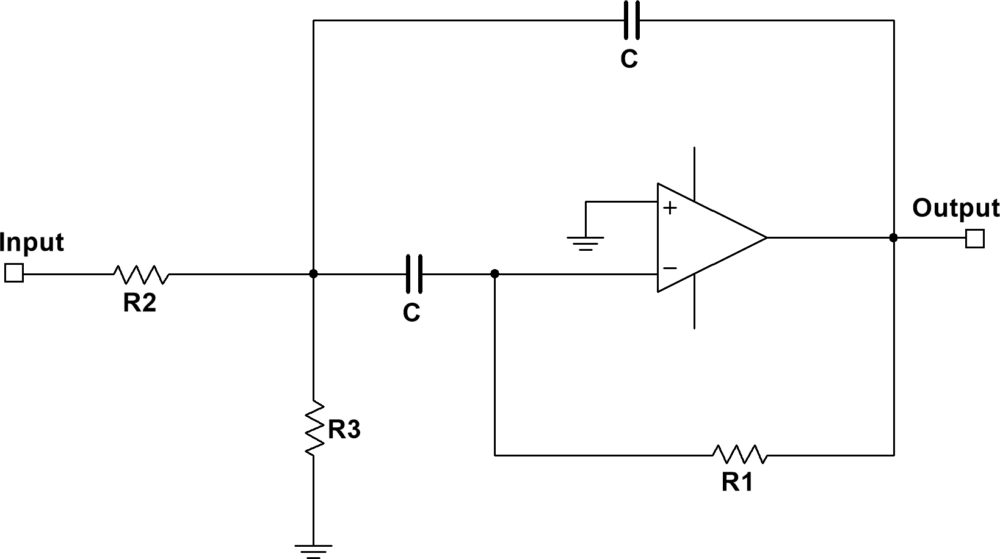
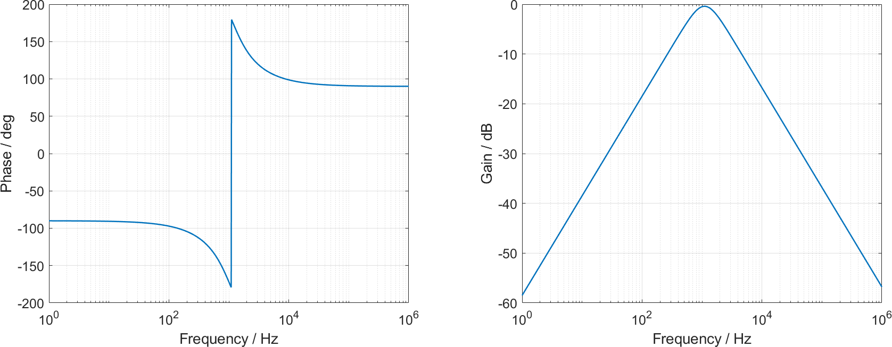
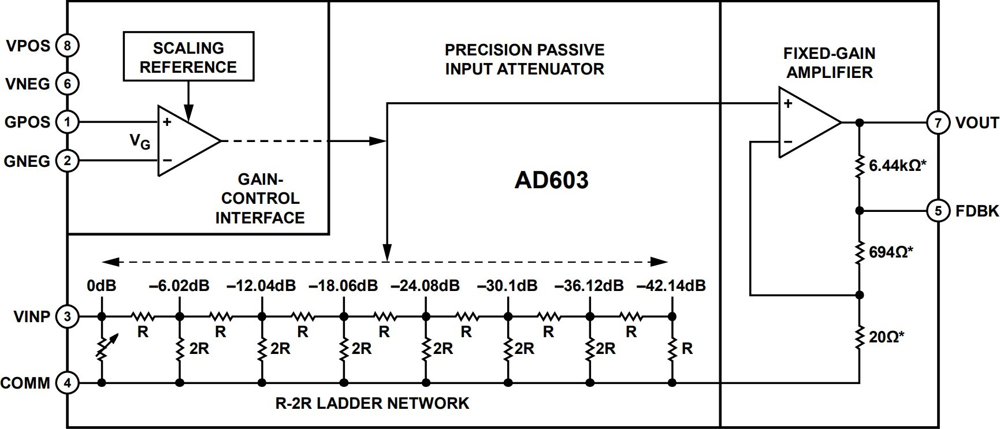
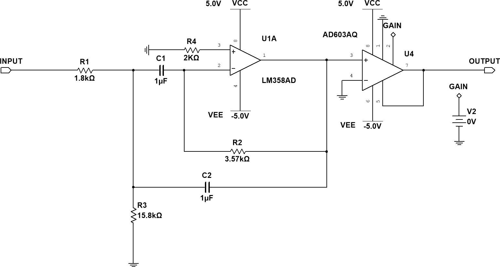
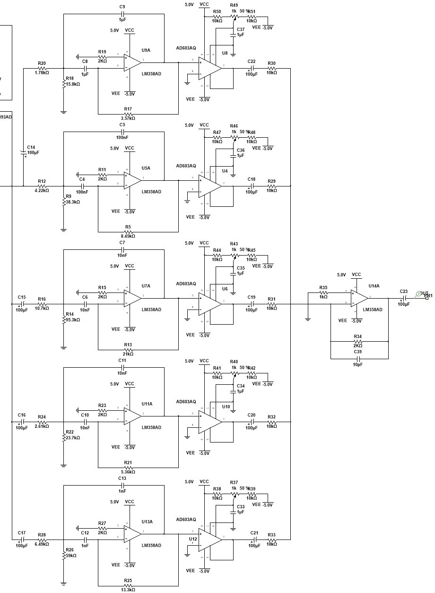
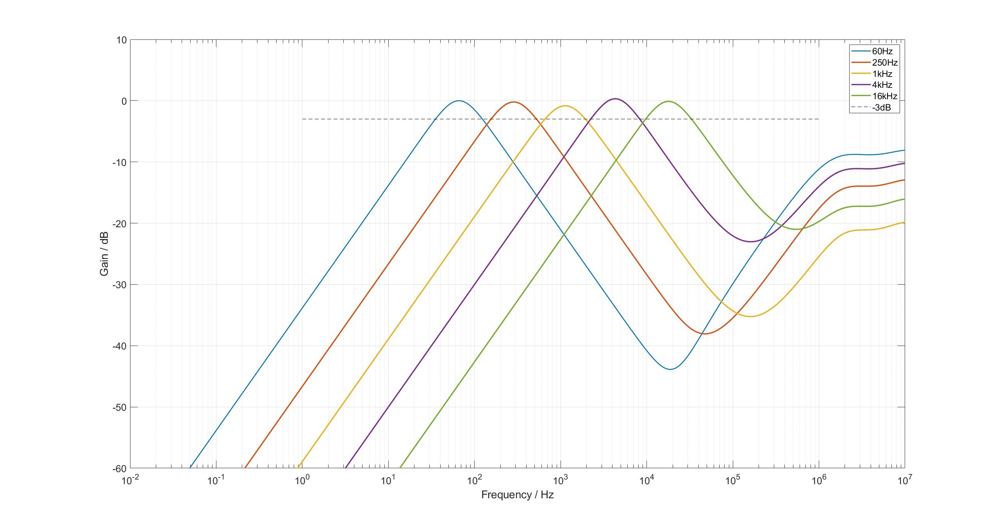
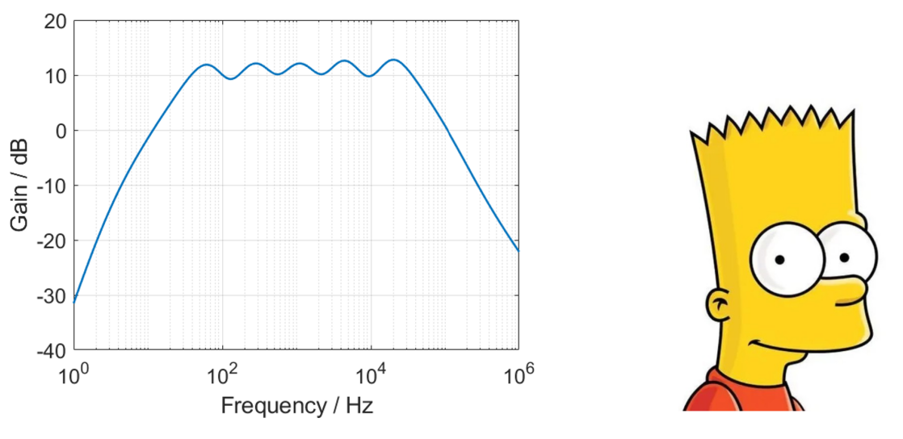
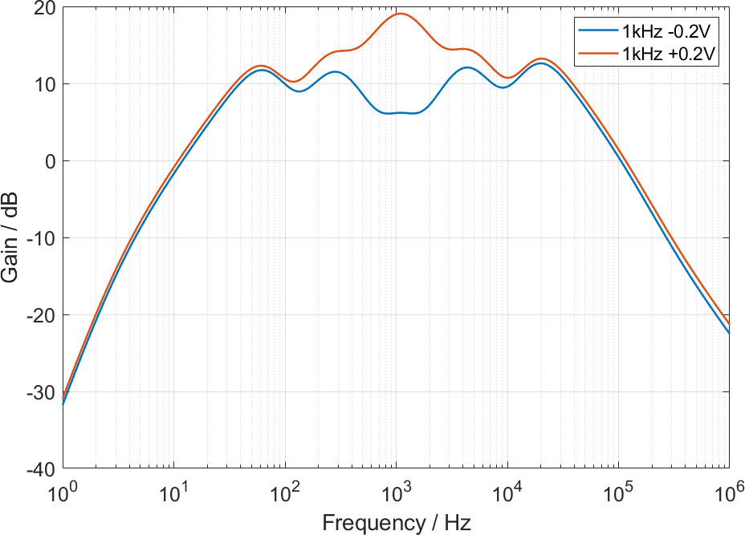
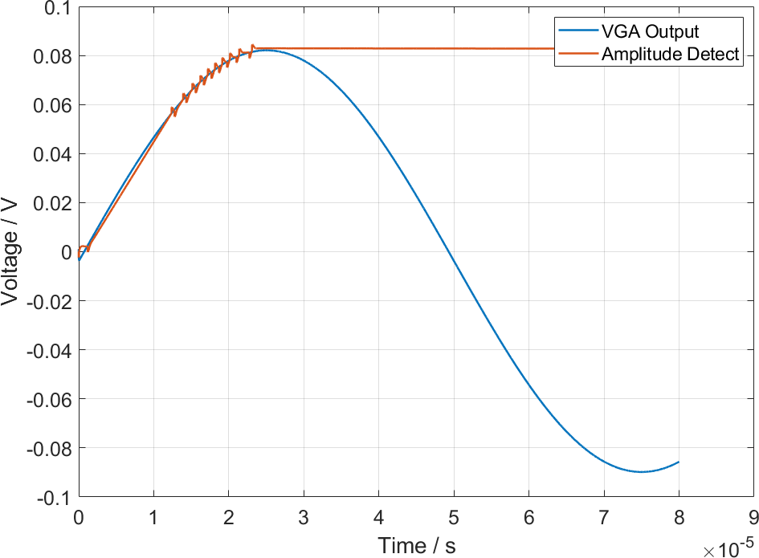
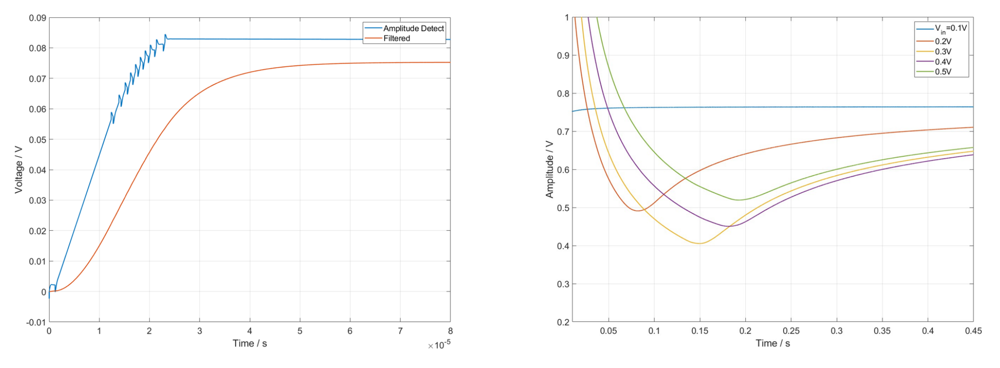

> 本文写于2023年7月13日，用于XLAB硬件电路组暑期内训项目，因清理硬盘重见天日，现在整理归档。以下是正文。

---

这篇文档给出了一种双音程音频均衡器的原理和设计思路。电路实现了对音频信号的分频段增益控制和混合，并带有一个适用于多种信号源的前级预放。总地来说，可以对音频的某一声调进行增强或衰减。

有很多种成熟方案实现上述功能，但或则采用无源反馈网络，电路分析非常繁琐，且各级电路相互勾结，实际上很难调整；或则控制方法复杂，需要对数电位器之类很难买到的器件；抑或精度太低，看着脑瘫。本文采用了一种折中方案，牺牲了成本，换来了还算不错的精度和易于大家分析的结构，而且相关分析方法已经在内训中介绍过。

文章写完，我翻了翻，带有一种潮腥味道，不堪卒读。但是电路组的朋友们也没有其它东西可以参考，因此还是发出来，请大家忍受。话虽如此，这个项目并不复杂，仅存的难度在于分析而非设计，大家以娱乐的心态完成即可。

---

# 原理
## 有源带通MFB滤波器

- **带通**：只有某一频段的信号能通过该滤波器，高于、低于截止频率的信号都被滤除。

- **有源**：用集成运放实现这种滤波器。

- **MFB**：一种二阶的滤波器拓扑。所谓二阶，就是指这种滤波器的传递函数具有两个极点。所谓极点，就是 s 域上令传递函数分母为零的点，它决定了系统对信号的响应模式。阶数越高，可以实现越陡峭的截止。二阶滤波器有两种结构：多重反馈（MFB）和 Sallen-Key，前者有 180° 的附加相移（反相），后者是同相。这个设计采用 MFB 结构，没有什么特别的理由。

$$ {{U_A}\left( {\frac{1}{{{R_2}}} + \frac{1}{{{R_3}}} + 2sC} \right) - {U_o}sC = \frac{{{U_i}}}{{{R_2}}}} $$

$$ {{U_A}sC =  - \frac{{{U_o}}}{{{R_1}}}} $$

图 1：带通 MFB 结构。A 点是 R2、R3 的公共点，懒得标了。

$$H(s) =  - \frac{{{R_1}{R_3}Cs}}{{{R_1}{R_2}{R_3}{C^2}{s^2} + 2{R_2}{R_3}Cs + {R_2} + {R_3}}}$$

$$H(j\omega ) =  - \frac{{j{R_1}{R_3}C\omega }}{{ - {R_1}{R_2}{R_3}{C^2}{\omega ^2} + 2j{R_2}{R_3}C\omega  + {R_2} + {R_3}}}$$

$$\left| {H(j\omega )} \right| = \frac{{{R_1}{R_3}C}}{{\sqrt {{{\left( {\frac{{{R_2} + {R_3}}}{\omega } - {R_1}{R_2}{R_3}{C^2}\omega } \right)}^2} + {{\left( {2{R_2}{R_3}C} \right)}^2}} }}$$

图 2：理想带通 MFB 的幅频、相频特性曲线，参数是随便取的

下面推导有源带通 MFB 的中心频率、中频增益、带宽和品质因数。
设传递函数的倒数为$G(j\omega)$，$G$ 对$\omega$求导：

$$\frac{{dG}}{{d\omega }} =  - 2\left( {\frac{{{R_2} + {R_3}}}{{{\omega ^2}}} + {R_1}{R_2}{R_3}{C^2}} \right)\left( {\frac{{{R_2} + {R_3}}}{\omega } - {R_1}{R_2}{R_3}{C^2}\omega } \right)$$

可知$G(j\omega)$和$\left| H(j\omega) \right|$有唯一的极值点：

$${f_0} = \frac{{{\omega _0}}}{{2\pi }} = \frac{1}{{2\pi C}}\sqrt {\frac{{{R_2} + {R_3}}}{{{R_1}{R_2}{R_3}}}}$$

注意到$R_2 + R_3 / R_2R_3 = 1/(R_2//R_3)$，因此：

$${f_0} = \frac{{{\omega _0}}}{{2\pi }} = \frac{1}{{2\pi C}}\sqrt {\frac{1}{{{R_1}{R_{23}}}}} $$

式中$R_{23} = R_2//R_3$。

中频增益就是该滤波器在 f0 处取得的增益，说白了就是最大增益：

$$Gai{n_{\max }} = {\left| {H(j\omega )} \right|_{\omega  = {\omega _0}}} = \frac{{{R_1}}}{{2{R_2}}}$$

**截止频率**定义为增益为 $Gain_{max} / \sqrt{2}$ 的 $\omega$，换句话说，截止频率处的增益比最大增益少 3dB。

**带宽**定义为带通滤波器两个截止频率的差。因此，要求带宽，只需要解下面这个方程：

$$G(j\omega ) = \frac{1}{{\left| {H(j\omega )} \right|}} = \frac{{\sqrt {{{\left( {\frac{{{R_2} + {R_3}}}{\omega } - {R_1}{R_2}{R_3}{C^2}\omega } \right)}^2} + 4R_2^2R_3^2{C^2}} }}{{{R_1}{R_3}C}} = \frac{{2\sqrt 2 {R_2}}}{{{R_1}}}$$

这个四次方程在$\omega>0$的范围内有两个解：

$${\omega _{1,2}} = \frac{{\sqrt {{R_2}{R_3}} }}{{{R_1}{R_2}{R_3}C}}\left( {1 \pm \sqrt {{R_1}{R_2} + {R_1}{R_3} + {R_2}{R_3}} } \right)$$

因此得到带宽：

$$BW = \frac{{{\omega _2} - {\omega _1}}}{{2\pi }} = \frac{1}{{\pi {R_1}C}}$$

**品质因数 Q** 定义为中心频率和带宽的比。Q 越大，滤波器的通带就越窄，选频特性就越好。

$$Q = \frac{{{f_0}}}{{BW}} = \frac{1}{2}\sqrt {\frac{{{R_1}}}{{{R_{23}}}}} $$

现在可以对 MFB 滤波器各个元件的取值做一个总结：

$${R_1} = \frac{{2Q}}{k}$$

$${R_2} = \frac{Q}{{kGai{n_{\max }}}}$$

$${R_3} = \frac{Q}{{k\left( {2{Q^2} - Gai{n_{\max }}} \right)}}$$

其中$k=2\pi f_0 C$。$C$ 就按照 $f_0$ 的量级随便取呗，别让 $R$ 太离谱就行。

---

## 分频段增益控制

上一节讨论的滤波器实现了对某一频段的选频，多个这样的滤波器就可以把一个完整的音频信号分割为多个频段。如果在每个滤波器后加入一个增益可变的放大器，就能对不同频段进行不同倍数的放大。最后只需要把这些频段加在一起，就又获得了一个完整的音频信号。

这一节的重点不在于分频段，而在于增益控制。如何实现一个可控增益的放大器呢？一种浅显的思路是，改变负反馈放大电路中的反馈系数，这样就能立即改变增益。对同相放大器，这意味着改变 $R_1$ 或 $R_2$，对反相放大器则类似地是 $R_3$ 和 $R_4$。

如果增益是人工调节的，只要把上述四个电阻中的任意一个换成电位器即可。如果要使用一个额外的电信号来调节增益，当然，也可以把这些电阻换为数字电位器，直接由数字信号控制，然而数字电位器的频率响应一般很差，而且很容易向电路引入噪声。另一种选择是，把四个电阻中唯一直接连接 GND 的 $R_2$ 换为 JFET（如果信号是恒正的，也可以换为 MOSFET，这时可以忽略 MOSFET 的体二极管），其 D-S 阻抗是由 G-S 电压控制的，因此外加的电压越大，D-S阻抗越小，同相放大比例也就越大。

问题在于，JFET 的线性电阻区非常小，而且其边界非常微妙，导致 JFET 控制的反馈网络几乎一定是非线性的，这为控制带来了很大麻烦。更严重的是，同相放大器的结构决定其增益必须大于 1，因此无法通过这一电路实现衰减。

这样看来，通过调整反馈网络而调节增益并不是个好办法。因此，很自然地，改进方案就是固定反馈网络，创造一个恒定增益的放大器，但是在这个放大器的输入级做一些手脚，使其输入的衰减是可以调整的。有很多种方法都能实现可控的衰减，比如用电阻和 JFET 分压，但是非线性的问题仍然存在。

---

本设计使用 AD603 作为可控增益放大器（VGA），这种芯片在内部集成了一个压控的电阻分压网络，对 pin3 输入的信号进行线性衰减。下图展示了一个 R-2R Ladder，这种结构的每个抽头都对上个抽头的信号进行-6.02dB（0.5 倍）的衰减。AD603 的创新之处在于，抽头的位置是可以连续变化的，通过 pin1、pin2 施加的电压来调整，因此可以实现 0dB—-42.14dB 的连续调整。

图 3：AD603 原理框图

引入 VGA 后，每个 MFB 滤波器就变成了这样：

图 4：MFB + VGA

这里通过一个电压源控制增益 Gain，但只是一个示意，实际上我们也不可能对每个频段的放大电路引入独立的电压源，实际电路中的增益控制电压是通过电位器控制的。某种程度上说这就是舍近求远，明明可以直接用电位器设置衰减。但电位器只是最低要求，我推荐大家采用其他方法设置增益电压，例如 DAC，例如 AGC，因为这个结构的优点就在于增益是通过其它电信号调整的。

现在假设你已经有了五个不同频段的滤波器，每个滤波器通过 VGA 加入了一个可控的增益：

图 5：5MFB + VGA

这里的取值使每个滤波器的通带覆盖两个八度音程，中心频率分别为 60Hz、250Hz、1kHz、 4kHz、16kHz。$C_{14}$—$C_{22}$ 是耦合电容，用于消除前后级的直流工作点干扰。从上往下数第二个滤波器的输入侧没有耦合电容，这是因为我忘了画了。另外，所有运放的型号是 TLV07， Multisim 里没有对应的模型，大家可以用 LM358 代替，没关系的。

图 6：独立频响

300kHz 后的频响和图2明显不同，这是运放本身的频率特性决定的。但是人耳的听力范围只到20kHz，因此高频响应和我们没关系了。如果你对此实在感到担忧，也可以用低通滤波器把所有高频分量都滤掉（虽然它们现在已经只有-10dB 了）。

图 7：左：5 MFB 混合后的整体频响；右：Bart Simpson

图 8：在 1kHz 滤波器对应的 VGA 上添加 ±0.2V 的增益控制电压

图8显示，增益控制“基本上”是线性的。但是为了让一个滤波器覆盖两个八度，我们的 Q 值设得太低（0.667），导致不同频段出现了交叠，最终增益控制还是有一定的非线性。

---

## 带有自动增益控制的预放

这一节我们谈谈怎么处理电路的输入。

为了让大家体验一把多用途、实用性稳定电子产品的设计，我们的信号源应该是多种多样的。虽然它们都通过 3.5mm 耳机接口输入，但真正的“源”可能是手机7，可能是 PC，也可能是无线接收机，甚至是无源的拾音器。尤其是对后两种而言，信号的幅值可能充满我们并不希望看到的变数。以麦克风为例，有人把话筒拿得很远，有人拿得很近，这是一个习惯问题，至少我认为把话筒拿得远的人并不是为了让自己的声音听起来小一点，但声音的衰减确实和距离有关。在这个问题上，我们的需求是把“总体上”的信号幅度归一化到同一级别，但是保留短时间内的强弱变化。

这一功能称为自动增益控制（Auto Gain Control, AGC）。简单地说，它是通过一个带有幅度反馈环的可变增益放大器实现的。一个幅度检测电路监控放大器在一段时间内的最大输出幅值，如果这个幅值太大，就降低增益。如果幅值太小，则提高增益。

图 9：AGC 预放

这个电路的核心仍然是作为 VGA 的 AD603。其输入经过 U2A-U1A 及其外围电路组成的幅度检测电路（鉴幅器），输出到积分器 U1B，然后反馈回 VGA。

鉴幅器利用了 U2A 的集电极开路（OC）结构。U3 输出超过 U2A pin3 时，U2A pin1 翻转为负电平，U1A 反相积分，直至 U1A pin1，即 U2A pin3 上升到 U2A pin2 的水平。由于 U2A pin1集电极开路，这时呈悬空或高阻状态，U1A 的输出电压保持。C2、R4 组成低通滤波器，用于消除积分器可能出现的毛刺。

这种鉴幅器的误差比较小，但一些参数需要仔细选取。R1 用于稳定静态工作点，防止可能的

（其实是一定会出现的）失调电压对 C1 充电，使电路直接饱和。R1 也控制了 C1 在 U2A 悬空时的放电速率，其实控制了电路的积分时间。R2、 C1 的时间常数决定电路对 VGA 输出幅度变化的敏感度，太敏感时会出现振荡，这里建议对直流电平积分的斜率不要超过 1。

图 10：鉴幅器工作波形

图 11：AGC 电路工作波形

U1B 单纯是一个减法积分器，和一般的积分器没什么区别，只不过输入是幅度检测信号和参考电压的加法。这里参考电压取负值（实际电路中通过 GND 与 VEE 分压设置），因此实际上是减法。

# 要求

（xlab内部内容，感觉往上放不太好，就不放了）

# 延伸阅读

[各种精度的八度音程，以及各种频率的试听](https://www.engineeringtoolbox.com/octave-bands-frequency-limits-d_1602.html)

[均衡器的 Q 值是如何确定的](https://www.sageaudio.com/blog/mastering/how-to-set-the-q-of-an-equalizer-to-an-octave)

R/2R 电阻网络应用（xlab内部链接）

MFB 应用笔记 （xlab内部链接）

Sallen-Key 滤波器结构分析 （xlab内部链接）

[均衡器的对数电位器方案](https://www.ti.com/lit/an/slyt134/slyt134.pdf?ts=1689106082682&ref_url=https%253A%252F%252Fwww.google.com%252F)

[直接用专用 IC 的傻瓜版 Graphic Equalizer](https://www.eleccircuit.com/10-band-graphic-equaliser/)

电院模电实验课采用的音调调节电路，我的实验报告（p3）（xlab内部链接）

AD603 数据手册（xlab内部链接）

TLV07 数据手册（xlab内部链接）
