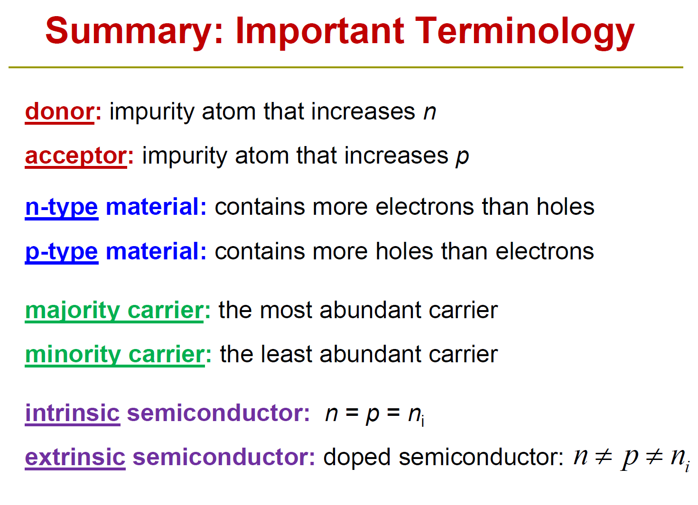

- [Semiconductor](#semiconductor)
- [Semiconductor Physics Recap](#semiconductor-physics-recap)
  - [Semiconductor Materials](#semiconductor-materials)
    - [Elemental: Diamond Cubic Structure](#elemental-diamond-cubic-structure)
    - [Compound: Zinc Blende Structure](#compound-zinc-blende-structure)
  - [Crystallographic Notation](#crystallographic-notation)
  - [Energy Band](#energy-band)
  - [Density of States:](#density-of-states)
  - [Concentration of Carriers](#concentration-of-carriers)
    - [Hole](#hole)
  - [Doping](#doping)
  - [Thermal dynamics](#thermal-dynamics)
    - [Fermi-Dirac Distribution](#fermi-dirac-distribution)
    - [Maxwell-Boltzman Distribution:](#maxwell-boltzman-distribution)
- [Summary](#summary)

# Semiconductor
- crystalline 单晶硅: wafar
- amorphous 太阳能电池

# Semiconductor Physics Recap

## Semiconductor Materials

Materials with intermediate conductivity and features sensitive to physical variables.

Atomic structures:
- **Crystalline**: Highly ordered atomic structure, wafar
- **Polycrystalline**: A cluster of multiple crystalline grains.
- **Amorphous**: Disordered atomic structure, PV cells.

Types:
- **Elemental**
    - IV group: Ge at first, then Si, recently C.
- **Compound**
    - III+V group, *pronounced three-five semiconductors*: AsGa, AlP.

### Elemental: Diamond Cubic Structure
价电子 valence electrons. 共价键 covalent bound.

Each Si atom has 4 nearest neighbors. Lattice constant: 5.431$\AA$ $(10^{-10}m)$.\
Number of atoms in a *unit cell*: $4 + 8/8 + 6/2 = 8$\
Density of silicon atoms: 8 atoms / cell volumn = $5\times 10^{22}$ atoms/cm3.\
Inpurity consentration: $10^{12} - 10^{19}$ atoms/cm3.

### Compound: Zinc Blende Structure
III-V compound. GaAs, GaP, GaN. High electron mobility, for high-speed ICs.

## Crystallographic Notation
- (h k l): crystal plane 晶面，截距倒数通分取分母
- {h k l}: equivalent plane 晶面族
- \[h k l]: direction
- \<h k l>: equivalent direction\
  h: inverse x intercept. k: inverse y. l: inverse z.

立方晶系中6个等同的{100}，12个等同的{110}，8个等同的{111}晶面。

Atom density is higher viewed in <100> direction -> lower carrier speed on that plane.

## Energy Band
泡利不相容：同一状态（主量子数n+角量子数l+磁量子数m+自旋量子数s）最多被一个费米子占据。费米子：遵循费米—狄拉克统计的粒子。

电子排布$3p^2$：第三层（主量子数n=3）p亚层（角量子数l=1）有2个电子。

$Si: [Ne]\quad3s^2\quad3p^2$。自由空间独立原子，3p层所有轨道在一个能级，3s层在另一个。两个Si原子靠近，形成8个价电子的系统，3p/3s能级分别分裂成两个。N个Si原子组成晶格，3p/3s层各有2N个填充的状态（每个价电子占据一个），形成价带，也各有2N个空状态，形成导带。

- **Valence Band**: Highest nearly-filled band.
- **Conduction Band**: Lowest nearly-empty band
- $E_c$: Bottom edge of the conduction band.
- $E_v$: Top edge of the valence band.
- $E_G$: Separation between $E_c$ and $E_v$.

Band gap of common materials:
- $Si: E_G = 1.12 eV$ @ 300K\
- $SiO_2: E_G = 9 eV$\
- Metals have no band gap (conduction band is partially filled)\
- Graphene = 0\

When temp rises, the lattice transform a little bit, resulting in a changed solution of quantum mechanics, and a shrunk band gap -> temp sensors.

Measurement: **minimum** energy of photons that is absorbed by the  semiconductor. 价带顶电子吸收能量跃迁到导带。

## Density of States:
$g(E)\rm{d}E$ =  number of states per cm3 in the energy range between $E$ and $E+\rm{d}E$.

Electron effective mass 电子有效质量, $m_n^*$

## Concentration of Carriers

To change the concentration of carriers:
- Adding impurity atoms (dopants)
- Applying an electric field
- Changing the temperature
- Irradiation 辐照

**Intrinsic** (本征) carrier concentration of silicon: $n_i \approx 10^{10} cm^{-3}$

In a pure semiconductor,

$$n = p = n_i$$

In a doped semiconductor, at thermal equilibrium (热平衡状态) Law of Mass Action:

$$n \cdot p = n_i^{2}$$

### Hole
Mobile positive charge associated with a half-filled covalent bond.

Holes and electrons are not necessarily in pairs. 极子器件.

## Doping
Substituting a Si atom with a special impurity atom. (Group III/V)

- **Donor ionization energy**: Separation between $E_c$ and donor level $E_D$
- **Accepttor ionization energy**: $E_A - E_v$ \
大概几十个meV，随杂质原子序数增大而提高

Donor/acceptor level are close to the $E_c$ or $E_v$ so ionization is easy.

- Ionized donor concentration: $N_D$
- Ionized acceptor concentration: $N_A$
- Net dopant concentration: $N_D - N_A$

Charge neutrality condition: $N_D + p = N_A + n$

When $N_D >> N_A$

$$n \approx N_D \qquad p \approx n_i^2/N_D$$

- **Majority carrier**: the most abundant.\
- **Minority carrier**: the least abundant.

## Thermal dynamics

### Fermi-Dirac Distribution
The **probability** that energy level E is occupied. Occupied = by electron, empty = occupied by hole.

 There is only one Fermi level in a system at equilibrium (multiple with externel electrical field),

$$f(E) = \frac{1}{1+e^{-\frac{E-E_F}{kT}}}$$

### Maxwell-Boltzman Distribution:

$$f(E) \approx e^{-\frac{E-E_F}{kT}} \qquad ,E-E_F >> kT \quad (E-E_F > 3kT)$$

$$f(E) \approx 1-e^{-\frac{E_F-E}{kT}} \qquad,E-E_F << -kT$$

简并（Degenerate）半导体：必须用F-D分布，非简并可以用M-B分布。

# Summary

- **Thermal equilibrium**: No external forces, no electric field, no magnetic field, no mechanical stress, no light.