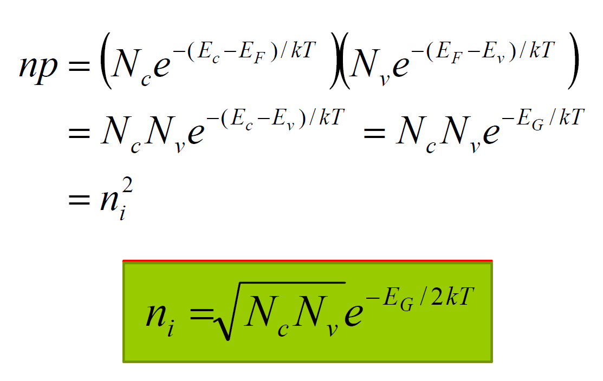

- [Distribution of Carriers](#distribution-of-carriers)
  - [Intrinsic Fermi Level](#intrinsic-fermi-level)
  - [Band Gap Narrowing](#band-gap-narrowing)
  - [Dopant Ionization](#dopant-ionization)

# Distribution of Carriers
Distribution of electrons at certain energy $n(E)$, is the product of state density of that energy $g_c(E)$, and the possibility that the energy level is filled by electrons $f(E)$.

(spacial) Density of electrons is the integral of $n(E)$

$$n = \int_{E_C}^{top} g_c(E)f(E){\rm{d}}E = N_ce^{-\frac{E_c-E_F}{kT}}$$

under Boltzmann approx. that requires:

$$E_v + 3kT \leq E_F \leq E_c - 3kT$$

in other words, the semiconductor is **non-degenerately doped**.

- $N_c$: the **effective density of states** in the conduction band, integral of $g_c(E)$.
- $n^+$: degenerately doped n-type semiconductor, where $E_F \approxeq E_c$.
- $p^+$: degenerately doped p-type.

Similarly, $p(E) = g_v(E) \cdot \left( 1-f(E) \right)$

Derive $E_F$ from $n$:

$$E_F = E_c - kTln(\frac{N_c}{n})$$

## Intrinsic Fermi Level
Using the fact that $n=p$ in intrinsic semiconductor:

$$E_F \equiv E_i$$

$E_i$ is the intrinsic Fermi level.

Also, given that $n=n_i$

$$N_c = n_i e^{\frac{E_c-E_i}{kT}}$$

So carrier concentration could be written as a function of $n_i$ and $E_i$:

$$n = n_i e^{\frac{E_F-E_i}{kT}}$$

$$p = n_i e^{\frac{E_i-E_F}{kT}}$$

## Band Gap Narrowing
If the dopant concentration is a significant fraction of the silicon atomic density, the energy-band structure is perturbed, and the band gap is reduced by $\Delta E_G$.

## Dopant Ionization
- **Dopant compensation**: the effect of one type of dopant is completely or partially cancelled by adding dopant of the opposite type.
- **Net dopant concentration**: the difference between the concentration of donor and acceptor dopant.

At extreme high temperature, the intrinsic excitation dominates,

$$n = p = n_i$$

and at extreme low temperature, the ionization becomes less significant,

$$n = \sqrt{\frac{N_cN_d}{2}}e^{-\frac{E_c-E_d}{2kT}}$$

