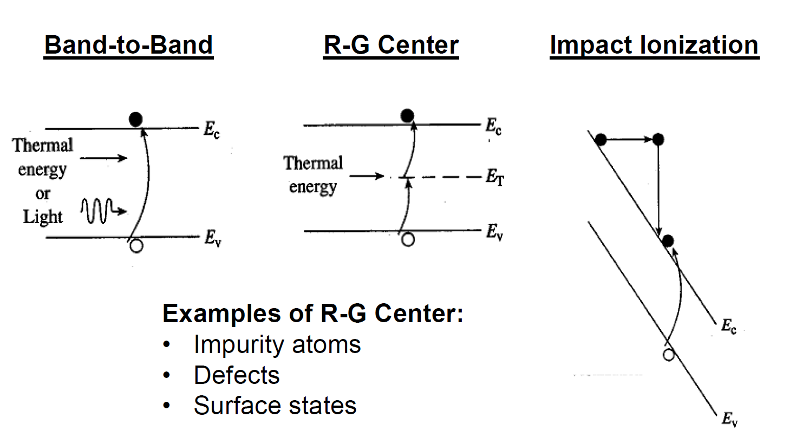
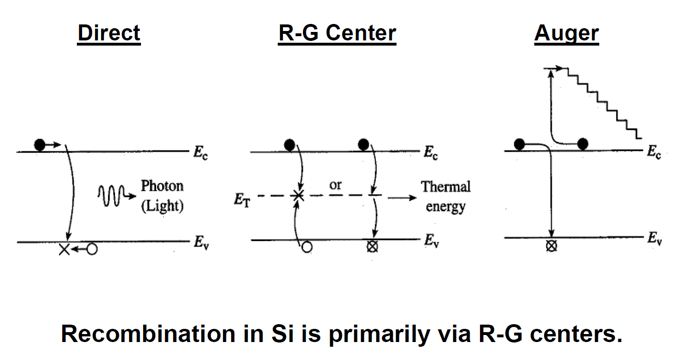

- [Carrier Actions in Semiconductor](#carrier-actions-in-semiconductor)
  - [Thermal Motion](#thermal-motion)
  - [Scattering](#scattering)
    - [Mean Free Time](#mean-free-time)
  - [Drift](#drift)
    - [Carrier Mobility](#carrier-mobility)
    - [Velocity Saturation](#velocity-saturation)
    - [Drift Current](#drift-current)
  - [Diffusion](#diffusion)
    - [Diffusion Current](#diffusion-current)
    - [Situation of Thermal Equilibrium](#situation-of-thermal-equilibrium)
  - [Generation and Recombination (R-G)](#generation-and-recombination-r-g)
    - [Generation](#generation)
    - [Recombination](#recombination)
    - [Indirect Band Gap](#indirect-band-gap)

# Carrier Actions in Semiconductor
- **Drift**: charged particle motion under the influence of an electric field.
- **Diffusion**: particle motion due to concentration gradient *or temperature gradient*.
- **Recombination-generation**: 

## Thermal Motion

$$\bar{E_k} = \frac{3}{2}kT=\frac{1}{2} m_n^* v_{th}^2$$

where $v_{th}$ denotes the thermal velocity (~$10^7$ cm/s at 300K).

## Scattering
- **Phonon Scattering**: due to collision with vibrating lattice, increases with elevated temp.
- **Impurity Scattering**: due to deflection caused by ionized impurity atoms, decreases with elevated temp.
- **Charge-charge Scattering**: due to deflection caused by Coulomb force between carriers, decreases with elevated temp.

### Mean Free Time
The lose of momentum in every collision equals to the increase of momentum between collisions:

$$m_n^* v_d = -qE\tau_{mn}$$

where $\tau_{mn}$ denotes the mean free time, $\tau_{mn}$ ~ 0.1 ps.

## Drift
### Carrier Mobility
A measure of the velocity of carriers under electric field of certain strength. $\mu$ has the dimension of $\rm cm^2/(V\cdot s)$

$$\mu_n \equiv \frac{q\tau_{mn}}{m_n^*}$$

$$v_d=\mu E$$

**Matthiessen's Rule**: the probability that a carrier will be scattered by mechanism i within a time period ${\rm d}t$ is ${\rm d}t/\tau_i$, where $\tau_i$ denotes the *mean time* between scattering events due to mechanism i.

$$\frac{1}{\tau_{mn}} = \frac{1}{\tau_{phonon}} + \frac{1}{\tau_{impurity}}$$

$$\frac{1}{\mu_{mn}} = \frac{1}{\mu_{phonon}} + \frac{1}{\mu_{impurity}}$$

> Use this chart to get $\mu$ when the total carrier concentration is known.

> Use this chart to get $\mu_n$ versus temperature.

### Velocity Saturation
When the kinetic energy of a carrier exceeds a critical value, it generates an optical phonon and loses the kinetic energy. Such phenomenon has a deleterious effect on device speed as in nano-scale transistors.

### Drift Current

$$J_{drift} = J_{n,drift} + J_{p,drift} = \sigma E = \left( qn\mu_n + qp\mu_p \right) E$$

$\sigma$ denoting conductivity is in S/cm and $\rho$ denoting resistivity is in $\Omega \cdot$cm.

## Diffusion
Carriers diffuse from regions of higher concentration to regions of lower concentration region, due to random thermal motion.

### Diffusion Current

$$J_{n,diff} = qD_N\frac{{\rm d}n}{{\rm d}x}$$

$$J_{p,diff} = -qD_P\frac{{\rm d}p}{{\rm d}x}$$

Where $D_N$ and $D_P$ are **diffusion coefficients** of electrons and holes, respectively, with the unit of $\rm cm^2/s$.

The total current, composing $J_{diff}$ and $J_{drift}$:

$$J_n = \sigma E = qn\mu_n E + qD_N\frac{{\rm d}n}{{\rm d}x}$$

$$J_p = \sigma E = qp\mu_p E - qD_N\frac{{\rm d}n}{{\rm d}x}$$

$$J = J_n + J_p$$

### Situation of Thermal Equilibrium

Under thermal equilibrium, $E_F$ is constant. If the semiconductor is not uniformly doped, then the energy band would vary with position, leading to a built-in electric field, then the drift current and the diffusion current cancels out, resulting in zero net current.

$$\frac{{{\rm{d}}n}}{{{\rm{d}}x}} =  - \frac{{{N_c}}}{{kT}}{e^{ - \frac{{{E_c} - {E_F}}}{{kT}}}}\frac{{{\rm{d}}{E_c}}}{{{\rm{d}}x}} =  - \frac{n}{{kT}}\frac{{{\rm{d}}{E_c}}}{{{\rm{d}}x}} =  - \frac{n}{{kT}}q\varepsilon$$

So,

$$qn\mu_n\varepsilon = qn \frac{qD_N}{kT}\varepsilon$$

then

$$D_N = \frac{kT}{q}\mu_n$$

$$D_P = \frac{kT}{q}\mu_p$$

namely **Einstein Relationship**, also valid under non-equilibrium conditions ($D_N$ is a constant).

Notice that

$$\frac{D}{\mu} = \frac{kT}{q}$$

## Generation and Recombination (R-G)
### Generation
- **Band-to-Band**: An electron in valence band gains enough energy (from phonons, etc.) and jumps into the conduction band.
- **R-G Center**: Also called deep-level defects. It lies in the band gap, and may generate a pair of electron-hole.
- **Impact Ionization**: A high-energy electron collides with an atom and knock an additional electron into the conduction band.
- 

### Recombination
- **Direct**: An electron in conduction band recombines with a hole in valence band, the released energy dissipates as a phonon.
- **R-G Center *(primary)***: Carriers recombines via defects states in the band gap.
- **Auger Recombination**: Energy released during carrier recombination is transferred to a third carrier, instead of being emitted as a photon.
- 

### Indirect Band Gap

