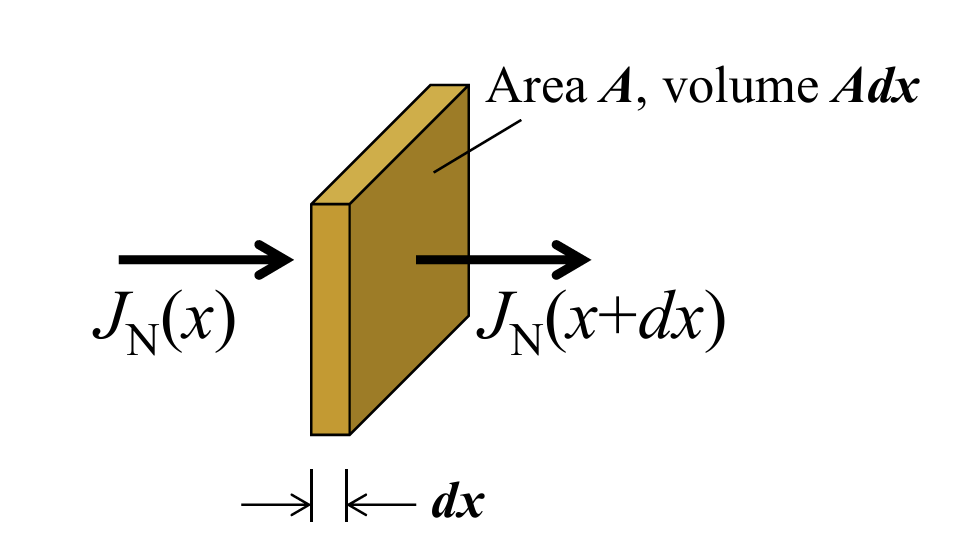

- [Minority Carrier's Behavior](#minority-carriers-behavior)
  - [Relaxation to Equilibrium State](#relaxation-to-equilibrium-state)
  - [Continuity Equations (universal)](#continuity-equations-universal)
    - [Minority Carrier Diffusion Equation](#minority-carrier-diffusion-equation)
  - [Quasi-Fermi Levels](#quasi-fermi-levels)

# Minority Carrier's Behavior

## Relaxation to Equilibrium State

The equilibrium state in a semiconductor with no net current is always being disturbed by sudden generation of excess carriers, and the system always relaxes back by recombination.

In other words, the generation and recombination of *minority carrier* should cancels out each other:

$$\frac{\delta n}{\delta t} = -\frac{\Delta n}{\tau_n}$$

for p-type, where $\Delta n$ is the excess electron density, $\tau$ is the **minority carrier lifetime**.

It means that the decrease rate of electrons is the ratio of excess electron density to the average time that an excess electron survives.

Since the dominant process of recombination in through R-G centers, $\tau_n$ and $\tau_p$ depend on the density of deep traps (深能级杂质).

$\tau$ is the *characteristic constant* of indirect R-G.

## Continuity Equations (universal)
Given an element volume of semiconductor:

$$Adx\left( {\frac{{\delta n}}{{\delta t}}} \right) =  - \frac{1}{q}A\left( {{J_N}(x) - J(x + dx)} \right) - \frac{{\Delta n}}{{{\tau _n}}}Adx$$

Where 
- $A{\rm d}x\left(\frac{\delta n}{\delta t}\right)$ is the changing rate of total electron number within the volume.
- $- \frac{1}{q}A\left( {{J_N}(x) - J(x + dx)} \right)$ is the net number of electron flowing *into* the volume. Notice an electron carries $-q$ of charge.
- $\frac{{\Delta n}}{{{\tau _n}}}Adx$ is the relaxation rate of excess electrons.

With:

$${J_N}(x + dx) = {J_N}(x) + \frac{{\delta {J_N}(x)}}{{\delta x}}dx$$

It is derived that

$$\frac{{\delta n}}{{\delta t}} = \frac{1}{q}\frac{{\delta {J_N}(x)}}{{\delta x}} - \frac{{\Delta n}}{{{\tau _n}}}$$

Taking the generation rate $G_L$ into consideration:

$$\frac{{\delta n}}{{\delta t}} = \frac{1}{q}\frac{{\delta {J_N}(x)}}{{\delta x}} - \frac{{\Delta n}}{{{\tau _n}}} + {G_L}$$

$$\frac{{\delta p}}{{\delta t}} = -\frac{1}{q}\frac{{\delta {J_P}(x)}}{{\delta x}} - \frac{{\Delta p}}{{{\tau _p}}} + {G_L}$$

### Minority Carrier Diffusion Equation
It is basically a special form of the continuity equations, assuming:

1. The electric field is small, so current is dominant by diffusion.
2. Uniform doping.
3. Low-level injection, which means *the excess carriers are negligible compared to the majority*.

$${J_N} \cong q{D_N}\frac{{\delta n}}{{\delta x}}$$

So

$${{\delta n} \over {\delta t}} = {1 \over q}{\delta  \over {\delta x}}\left( {q{D_N}{{\delta n} \over {\delta x}}} \right) - {{\Delta n} \over {{\tau _n}}} + {G_L}$$

$n$ consists of the equilibrium $n_0$ and excess $\Delta n$, and $n_0$ is irrelevant to $t$:

$${{\delta \left( {{n_0} + \Delta n} \right)} \over {\delta t}} = {1 \over q}{\delta  \over {\delta x}}\left( {q{D_N}{{\delta \left( {{n_0} + \Delta n} \right)} \over {\delta x}}} \right) - {{\Delta n} \over {{\tau _n}}} + {G_L}$$

$${{\delta \Delta n_p} \over {\delta t}} = {D_N}{{{\delta ^2}\Delta n_p} \over {\delta {x^2}}} - {{\Delta n_p} \over {{\tau _n}}} + {G_L}$$

Where $n_p$ means that $n$ in the equation is the minority carrier in p-type semiconductor.

At **special cases** the equation can be simplified:
- **Steady state**:  $\frac{\delta \Delta n_p}{\delta t} = 0$, meaning the concentration of excess electron becomes stable, such as the injection rate of net current and the recombination rate cancels out.
- **No diffusion current**: ${D_N}{{{\delta ^2}\Delta n_p} \over {\delta {x^2}}} = 0$. **WHY ??**
- **No R-G**: $\frac{\Delta n}{\tau_n} = 0$.
- **No light**: $G_L = 0$. **What about other generation process?**.

In a special (yet common) case that minority holes are injected at x=0 and there is no light absorption, when the system reaches steady state:

$$0 = {D_P}{{{\delta ^2}\Delta {p_n}} \over {\delta {x^2}}} - {{\Delta {p_n}} \over {{\tau _p}}}$$

$$\therefore {{{\delta ^2}\Delta {p_n}} \over {\delta {x^2}}} = {{\Delta {p_n}} \over {{D_P}{\tau _p}}}$$

- $L_P \equiv \sqrt{D_P \tau_p}$ is the **hole diffusion length**, it is the average distance that a minority carrier diffuses before it recombines with a majority carrier.

Set the boundary conditions as $\Delta  p_n(0) = \Delta p_{n0}$, and $\Delta p_n(\infty)=0$, the equation has a solution:

$$\Delta {p_n}(x) = \Delta {p_{n0}}{e^{ - {x \over {{L_P}}}}}$$

## Quasi-Fermi Levels
$E_{FN}$ and $E_{FP}$ are defined to preserve the appearance of $n=n_i e^{\frac{E_F-E_i}{kT}}$.

$$n=n_i e^{\frac{E_{FN}-E_i}{kT}} \qquad F_N \equiv E_i + kTln\left(\frac{n}{n_i}\right)$$

$$p=n_i e^{\frac{E_i-E_{FP}}{kT}} \qquad F_P \equiv E_i - kTln\left(\frac{p}{n_i}\right)$$

