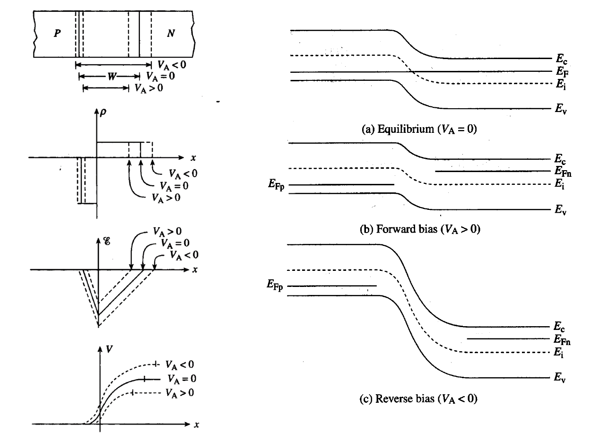
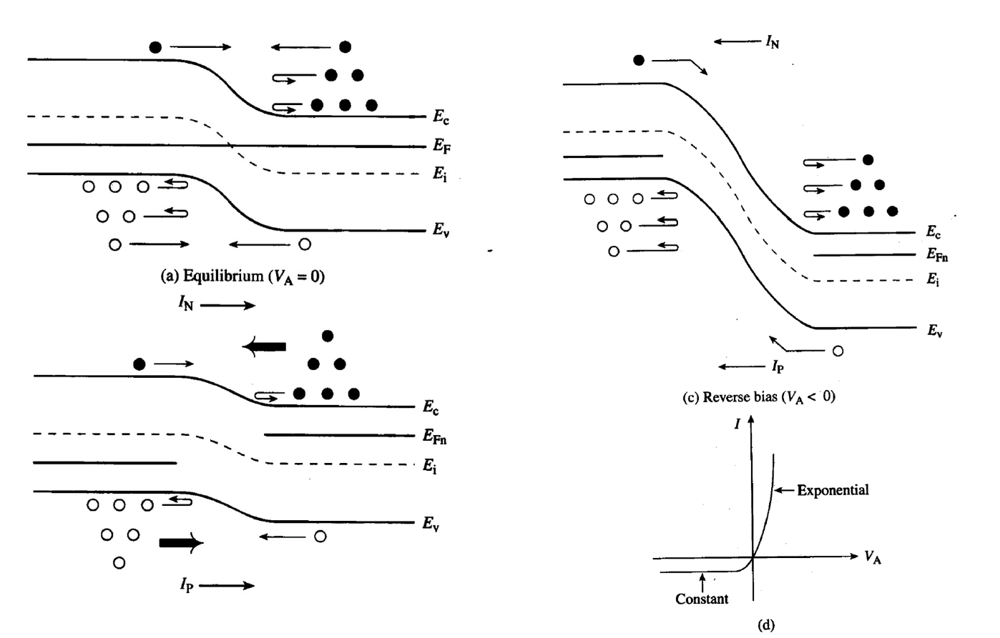

- [P-N Junctions](#p-n-junctions)
  - [Built-in Potential $V\_{bi}$](#built-in-potential-v_bi)
  - [Electric Field in Depletion Layer](#electric-field-in-depletion-layer)
  - [Electric Potential in Depletion Layer](#electric-potential-in-depletion-layer)
    - [Depletion Layer Width](#depletion-layer-width)
  - [Reversed-Biased PN Junction](#reversed-biased-pn-junction)
    - [Capacitance-Voltage Characteristics](#capacitance-voltage-characteristics)
    - [Peak Electric Field](#peak-electric-field)
    - [Breakdown](#breakdown)
  - [Forward-Biased PN Junction](#forward-biased-pn-junction)
    - [Minority Carrier Distribution in Quasi-Neutral Region](#minority-carrier-distribution-in-quasi-neutral-region)
    - [Total Current](#total-current)
    - [Contributions from Depletion Region](#contributions-from-depletion-region)
  - [Small Signal Model](#small-signal-model)

# P-N Junctions

## Built-in Potential $V_{bi}$
Positive charge is left on n-side, and negative on p-side, so the potential on n-side is higher. The electrons in the depletion layer tend to drift to n-side, indicating $E_c$ bends lower on n-side.

With respect to the uniform $E_F$, energy band on n-side is lowered by $E_F - E_i$, and that on p-side is lifted by $E_i - E_F$.

$$qV_{bi} = (E_i - E_F)_{p-side} + (E_F - E_i)_{n-side}$$

On n-side,

$$n = {n_i}{e^{\frac{{{E_F} - {E_i}}}{{kT}}}}$$

so,

$$\left({E_F} - {E_i}\right)_{n-side} = kT\ln \left( {\frac{n}{{{n_i}}}} \right) = kT\ln \left( {\frac{{{N_D}}}{{{n_i}}}} \right)$$

similarly,

$${\left( {{E_i} - {E_F}} \right)_{p - side}} = kT\ln \left( {\frac{p}{{{n_i}}}} \right) = kT\ln \left( {\frac{{{N_A}}}{{{n_i}}}} \right)$$

then $V_{bi}$ is a function of $N_D$ of n-side and $N_A$ of p-side.

$${V_{bi}} = \frac{{kT}}{q}\ln \left( {\frac{{{N_A}{N_D}}}{{n_i^2}}} \right)$$

For $\rm p^+n$ junction, $N_{A,p-side} >> N_{D,n-side}$, $\ln\left(N_D/n_i\right)$ is negligible (notice $N_D$ is still larger than $n_i$).

$$V_{bi} = \frac{kT}{q}\ln\left(\frac{N_A}{n_i}\right)$$

## Electric Field in Depletion Layer

- **The Depletion Approximation**: Charge density on p-side is $\rho = -qN_A$ and that on n-side is $\rho = qN_D$.
- **Poisson's Equation**: 

$$\frac{{{{\text{d}}^2}V}}{{{\text{d}}{x^2}}} =  - \frac{{{\text{d}}E}}{{{\text{d}}x}} =  - \frac{\rho }{{{\varepsilon _s}}}$$

On p-side, letting electric field at $x=-x_p$ to be zero,

$$\frac{{{\text{d}}E}}{{{\text{d}}x}} =  - \frac{{q{N_A}}}{{{\varepsilon _s}}} \qquad E(x) =  - \frac{{q{N_A}}}{{{\varepsilon _s}}}\left( {x + {x_p}} \right)$$

On n-side letting E-field at $x=x_n$ to be zero,

$$\frac{{{\text{d}}E}}{{{\text{d}}x}} = \frac{{q{N_D}}}{{{\varepsilon _s}}} \qquad E(x) = \frac{{q{N_A}}}{{{\varepsilon _s}}}\left( {x - {x_n}} \right)$$

The electric field should be continuous at $x=0$, leading to

$${N_A}{x_p} = {N_D}{x_n}$$

**Depletion width of the lightly doped side is narrower.**

## Electric Potential in Depletion Layer

$$V(x) = V({x_0}) - \int\limits_{{x_0}}^x {E(x'){\text{d}}x'} $$

On p-side, let $x_0 = -x_p$ and $V(-x_p) = 0$,

$$V(x) = \frac{{q{N_A}}}{{2{\varepsilon _s}}}{\left( {x + {x_p}} \right)^2}$$

On n-side, let $x_0 = x_n$ and $V(x_n) = V_{bi}$,

$$V(x) = {V_{bi}} - \frac{{q{N_D}}}{{2{\varepsilon _s}}}{\left( {x - {x_n}} \right)^2}$$

The electric potential should also be continuous at $x=0$,

$$\frac{{q{N_A}}}{{2{\varepsilon _s}}}x_p^2 = {V_{bi}} - \frac{{q{N_D}}}{{2{\varepsilon _s}}}x_n^2$$

### Depletion Layer Width
With the electric field and electric potential continuity equations, $x_n$ and $x_p$ are solvable.

$${x_p} = \sqrt {\frac{{2{\varepsilon _s}{V_{bi}}}}{q}\left( {\frac{{{N_D}}}{{{N_A}\left( {{N_A} + {N_D}} \right)}}} \right)} $$

$${x_n} = \sqrt {\frac{{2{\varepsilon _s}{V_{bi}}}}{q}\left( {\frac{{{N_A}}}{{{N_D}\left( {{N_A} + {N_D}} \right)}}} \right)} $$

$$W = {x_n} + {x_p} = \sqrt {\frac{{2{\varepsilon _s}{V_{bi}}}}{q}\left( {\frac{1}{{{N_A}}} + \frac{1}{{{N_D}}}} \right)} $$

Define $1/N = \left( 1/N_A + 1/N_D \right)$

For one-sided junction at equilibrium, the built-in potential is determined by the heavily doped side, while the depletion layer width is determined by the lightly doped side.

$${V_{bi,{{\text{p}}^ + }{\text{n}}}} = \frac{{kT}}{q}\ln \frac{{{N_A}}}{{{n_i}}}$$

$${W_{{{\text{p}}^ + }{\text{n}}}} \cong {x_n} = \sqrt {\frac{{2{\varepsilon _s}{V_{bi}}}}{{q{N_D}}}} $$

## Reversed-Biased PN Junction
The superimposed electric field enhances the built-in electric field, widening the depletion layer.

$$W = \sqrt {\frac{{2{\varepsilon _s}\left( {{V_{bi}} + \left| {{V_r}} \right|} \right)}}{{qN}}} $$

Where $V_{bi} + \left| V_r \right|$ is defined as the **potential barrier**.

### Capacitance-Voltage Characteristics

$$C_{dep} = A\frac{\epsilon_s}{W_{dep}}$$

$$\frac{1}{{{C^2}}} = \frac{{2\left( {{V_{bi}} + \left| {{V_r}} \right|} \right)}}{{qN{\varepsilon _s}{A^2}}}$$

The slope of $1/C^2$ to $V_r$ can be used to determine $N_h$ and $N_l$. First, use the slope to determine $N_l$, then assume the intercept to be $V_{bi}$ and use $V_{bi}$ to calculate $N_h$.

### Peak Electric Field
The peak electric field is at $x=0$:

$${E_{peak}} = E\left( 0 \right) = \sqrt {\frac{{2qN}}{{{\varepsilon _s}}}\left( {{V_{bi}} + \left| {{V_r}} \right|} \right)}  = \frac{{2\left( {{V_{bi}} + \left| {{V_r}} \right|} \right)}}{W}$$

### Breakdown
Given the critical electric field strength of certain material $E_{crit}$,

$${V_{BD}} = \frac{{{\varepsilon _s}E_{crit}^2}}{{2qN}} - {V_{bi}}$$

There are two types of mechanism of breakdown:
- **Tunneling Breakdown**: Dominant if both sides of a junction are very heavily doped.
- **Avalanche Breakdown**: Energetic electron cause impact ionization, resulting in a positive feedback.

## Forward-Biased PN Junction
Apply the forward biasing voltage $V_A$, and assume $V_A < V_{bi}$ for low-level injection conditions.

At equilibrium, a small number of electrons on the n-side gains enough energy to overcome the barrier and diffuse to the p-side, but the drifting of the minority electron on p-side balances the diffusion, so no net current.

With a forward bias voltage $V_A > 0$, the diffusion overshadows the drifting, so more minority carriers are injected and then recombine with majority carriers in the quasi-neutral regions.

Under low-level injection conditions, the majority carrier concentration at the edge of depletion layer remains the same.

$${p_p}( - {x_p}) = {N_A} \qquad {n_n}({x_n}) = {N_D}$$

In the depletion layer, the distribution of $p$ and $n$ follows their quasi-Fermi levels:

$$p = {n_i}{e^{\frac{{{E_i} - {E_{FP}}}}{{kT}}}} \qquad n = {n_i}{e^{\frac{{{E_{FN}} - {E_i}}}{{kT}}}}$$

Although the $E_{FP}$ and $E_{FN}$ is not known yet, $pn$ can be derived by:

$$pn = n_i^2{e^{\frac{{{E_{FN}} - {E_{FP}}}}{{kT}}}} = n_i^2{e^{\frac{{q{V_A}}}{{kT}}}}$$

$${n_p}( - {x_p}) = \frac{{n_i^2{e^{\frac{{q{V_A}}}{{kT}}}}}}{{{N_A}}} \qquad {p_n}({x_n}) = \frac{{n_i^2{e^{\frac{{q{V_A}}}{{kT}}}}}}{{{N_D}}}$$

At equilibrium $E_{FN} = E_{FP}$. **WHAT DOES THAT MEAN?**

### Minority Carrier Distribution in Quasi-Neutral Region
The minority carriers injected due to $V_A$ recombine with the majority carrier in the quasi-neutral region.

For excess holes on n-side, the holes flowing out of an element volume is the holes flowing in minus the holes recombined within the volume.

$$A\frac{{{J_p}(x + \Delta x)}}{q} = A\frac{{{J_p}(x)}}{q} - A\Delta x\frac{{\Delta p}}{\tau }$$

$$\frac{{{\text{d}}{J_p}}}{{{\text{d}}x}} =  - q\frac{{\Delta p}}{\tau }$$

Assuming the minority drift current is negligible,${J_p} =  - q{D_P}\frac{{{\text{d}}p}}{{{\text{d}}x}}$

$$\frac{{{{\text{d}}^2}\Delta p}}{{{\text{d}}{x^2}}} = \frac{{\Delta p}}{{{D_P}{\tau _p}}} = \frac{{\Delta p}}{{L_p^2}}$$

The boundary conditions are $\Delta p(\infty) = 0$ and $\Delta p(x_n) = p_n(x_n) - p_{n0}(x_n)$ (refer to the slide screenshot above).

$$\Delta p(x) = {p_{n0}}\left( {{e^{\frac{{qV}}{{kT}}}} - 1} \right){e^{ - \frac{{x - {x_n}}}{{{L_P}}}}}$$

### Total Current
The total current density is uniform throughout the junction, and at $x_n$ there is $J_{total} = J_{pN}(x_n) + J_{nN}(x_n)$. Notice $J_{nN}(x_n) = J_{nP}(-x_p)$, and the minority carrier diffusion current can be derived from

$${J_{pN}} =  - q{D_P}\frac{{{\text{d}}p}}{{{\text{d}}x}} \qquad {J_{nP}} = q{D_N}\frac{{{\text{d}}n}}{{{\text{d}}x}}$$

So the total current is:

$${J_{total}} = {J_{pN}}({x_n}) + {J_{nP}}( - {x_p}) = \left( {q\frac{{{D_P}}}{{{L_P}}}{p_{n0}} + q\frac{{{D_n}}}{{{L_n}}}{n_{p0}}} \right)\left( {{e^{\frac{{qV}}{{kT}}}} - 1} \right)$$

Which is proportional to $e^{qV/kT}-1$, so

$$I = {I_0}\left( {{e^{\frac{{qV}}{{kT}}}} - 1} \right)$$

Where

$${I_0} = Aqn_i^2\left( {\frac{{{D_P}}}{{{L_P}{N_D}}} + \frac{{{D_N}}}{{{L_N}{N_A}}}} \right)$$

The higher the temperature, the higher the current.

### Contributions from Depletion Region
The space-charge region current adds a leakage to $I$,

$$I = {I_0}\left( {{e^{\frac{{qV}}{{kT}}}} - 1} \right) + A\frac{{q{n_i}W}}{\tau }\left( {{e^{\frac{{qV}}{{2kT}}}} - 1} \right)$$

## Small Signal Model
